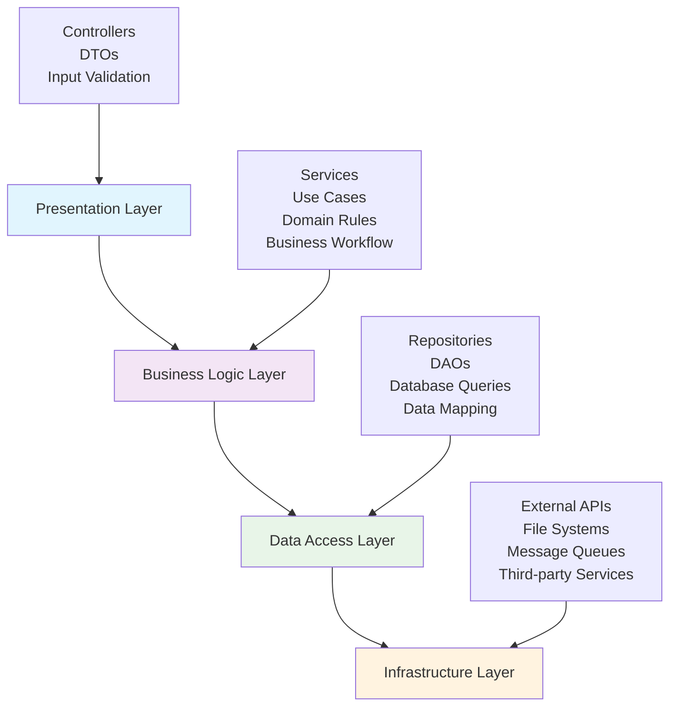
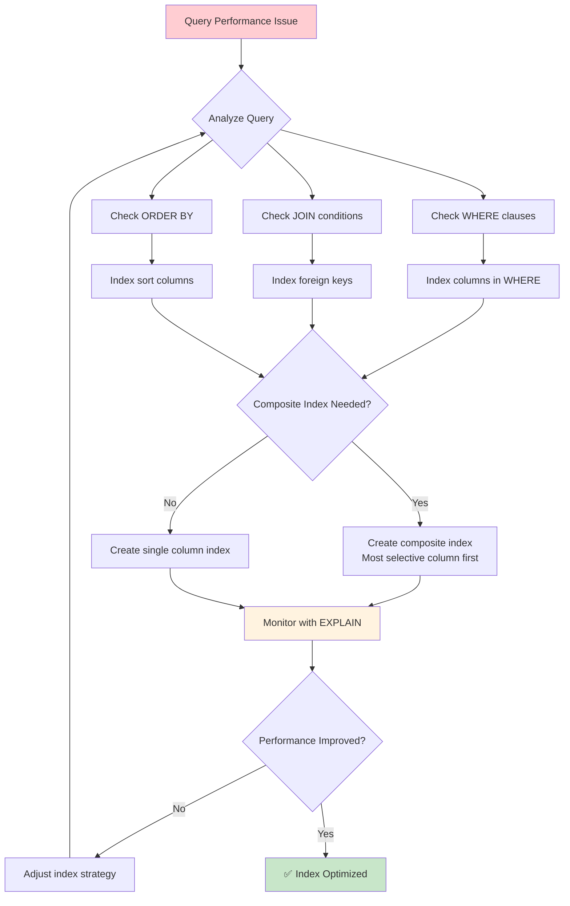
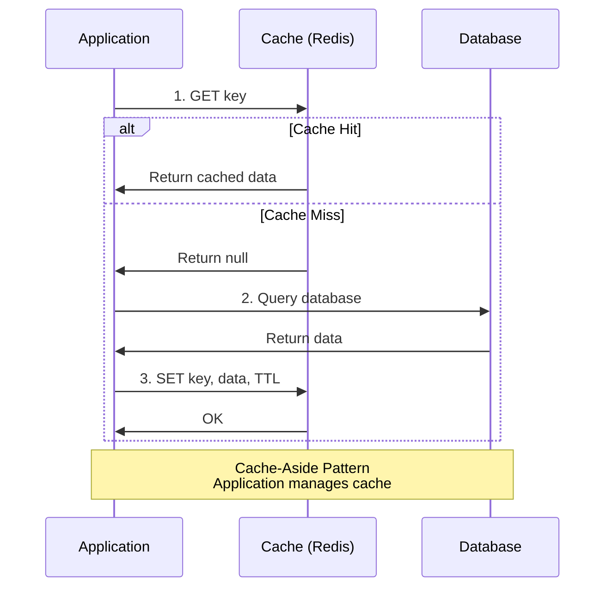
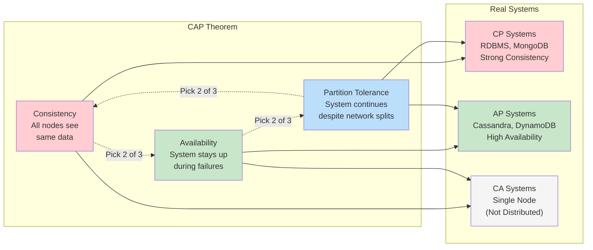
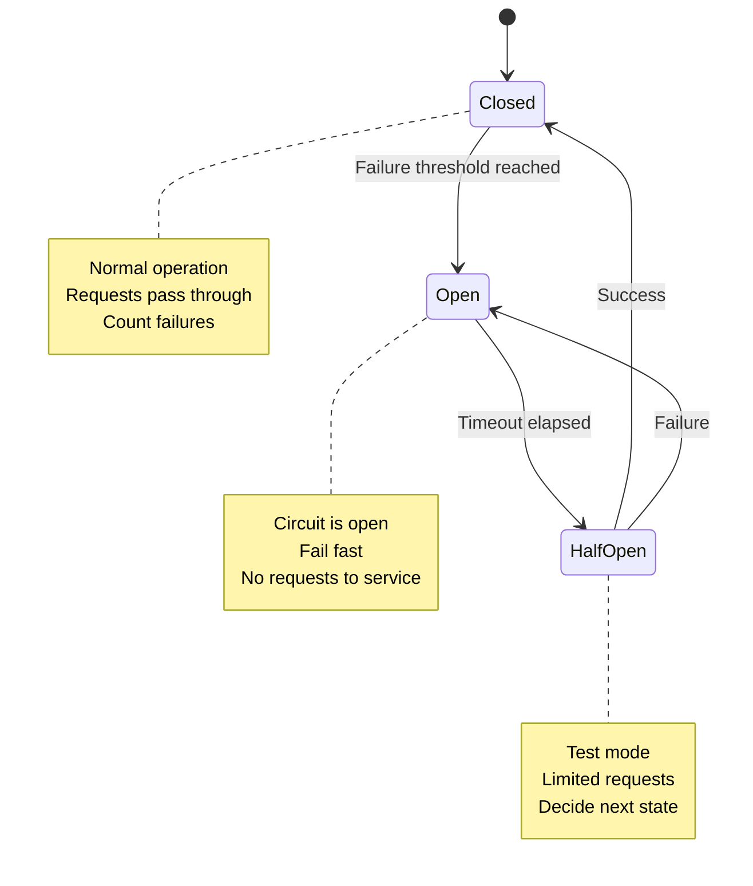
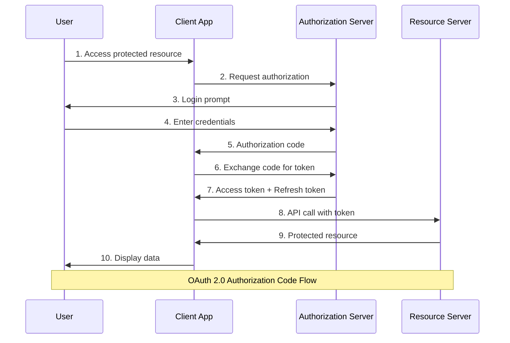

# 🎯 Senior Backend Engineering Interview Cheat Sheet

*Every concept you need to ace your next interview*

## 🔥 Most Asked Topics

*Practice these first - they appear in 60%+ of interviews*

### 💾 Database Connections & Pooling

**Asked in 85% of interviews**

#### ❌ Wrong Approach

Creating new connection per request:
```python
def handle_request():
    conn = psycopg2.connect("postgresql://...")  # DON'T DO THIS!
    # Use connection
    conn.close()
```

#### ✅ Correct Approach

Using connection pooling:
```python
# Initialize once at app startup
pool = psycopg2.pool.ThreadedConnectionPool(
    minconn=5, maxconn=50, 
    host="localhost", database="mydb"
)

def handle_request():
    conn = pool.getconn()  # Reuse existing connection
    try:
        # Use connection
        pass
    finally:
        pool.putconn(conn)  # Return to pool
```

#### 🎯 Key Interview Points

- **Connection pools** maintain 10-50 persistent connections
- Connections stay alive for entire pod/process lifetime
- Avoids TCP handshake overhead (3-way handshake per request = expensive!)
- Key configuration: `max_connections`, `idle_timeout`, `connection_lifetime`
- Use health checks to validate connections before use

---

### 🔐 ACID Properties

**Asked in 70% of interviews**

**Full Form:** Atomicity, Consistency, Isolation, Durability

| Property | What It Means | Real Example |
|----------|---------------|--------------|
| **Atomicity** | All-or-nothing transactions | Bank transfer: both debit AND credit succeed, or neither |
| **Consistency** | Data integrity maintained | Foreign keys, unique constraints always valid |
| **Isolation** | Concurrent transactions don't interfere | User A's transaction doesn't see User B's uncommitted changes |
| **Durability** | Committed data survives crashes | Data written to disk, survives power failures |

#### 🔥 Common Follow-up: Isolation Levels

| Level | Dirty Read | Non-Repeatable Read | Phantom Read |
|-------|------------|---------------------|--------------|
| **Read Uncommitted** | ✅ Possible | ✅ Possible | ✅ Possible |
| **Read Committed** | ❌ Prevented | ✅ Possible | ✅ Possible |
| **Repeatable Read** | ❌ Prevented | ❌ Prevented | ✅ Possible |
| **Serializable** | ❌ Prevented | ❌ Prevented | ❌ Prevented |

---

### 🏗️ Code Architecture Layers

**Asked in 75% of interviews**

#### ❌ Wrong Approach

Business logic in controllers:
```python
@app.route('/users', methods=['POST'])
def create_user():
    # DON'T PUT BUSINESS LOGIC HERE!
    if not email_valid(request.json['email']):
        return error()
    user = User(email=request.json['email'])
    db.session.add(user)
    send_welcome_email(user)  # Business logic in controller!
```

#### ✅ Correct Approach

Layered architecture:
```python
# Controller Layer (Presentation)
@app.route('/users', methods=['POST'])
def create_user():
    try:
        user = user_service.create_user(request.json)
        return jsonify(user.to_dict()), 201
    except ValidationError as e:
        return jsonify({"error": str(e)}), 400

# Service Layer (Business Logic)
class UserService:
    def create_user(self, data):
        self._validate_user_data(data)  # Business rule
        user = self.user_repository.create(data)
        self.email_service.send_welcome(user)  # Business workflow
        return user

# Repository Layer (Data Access)
class UserRepository:
    def create(self, data):
        user = User(**data)
        db.session.add(user)
        db.session.commit()
        return user
```

#### 🎯 The 4 Essential Layers



1. **Presentation** → Controllers, DTOs, validation
2. **Business Logic** → Services, use cases, domain rules
3. **Data Access** → Repositories, DAOs, database queries
4. **Infrastructure** → External APIs, file systems, message queues

---

## 🚀 Performance & Optimization

*High-frequency interview topics*

### 📊 Database Indexing Strategy

#### 🔥 Most Asked Question

"When and how do you create indexes?"



#### ✅ Always Index These
- Primary keys (automatic)
- Foreign keys (manual!)
- Columns in WHERE clauses
- Columns in JOIN conditions
- Columns in ORDER BY

#### ❌ Don't Index These
- Small tables (<1000 rows)
- Columns that change frequently
- Wide columns (VARCHAR(MAX))

```sql
-- ✅ Good indexing examples
CREATE INDEX idx_users_email ON users(email);  -- Login queries
CREATE INDEX idx_orders_user_date ON orders(user_id, created_at);  -- Composite
CREATE INDEX idx_products_category_price ON products(category_id, price);  -- Range queries

-- ❌ Bad indexing
CREATE INDEX idx_users_bio ON users(biography);  -- Large text field
```

#### 🎯 Perfect Interview Answer

"Index columns used in WHERE, JOIN, and ORDER BY. Always index foreign keys. Use composite indexes with most selective column first. Monitor query execution plans with EXPLAIN."

---

### 🔄 N+1 Query Problem

**Asked in 60% of interviews**

#### ❌ The Problem
```python
# This generates N+1 queries!
users = User.query.all()  # 1 query
for user in users:
    print(user.orders)  # N queries (one per user)
```

#### ✅ Solutions

**Option 1: Eager Loading**
```python
users = User.query.options(joinedload(User.orders)).all()  # 1 query
```

**Option 2: Batch Loading**
```python
users = User.query.all()
user_ids = [u.id for u in users]
orders = Order.query.filter(Order.user_id.in_(user_ids)).all()  # 2 queries total
```

**Option 3: Join Query**
```sql
SELECT u.*, o.* 
FROM users u 
LEFT JOIN orders o ON u.id = o.user_id;
```

---

### 🗄️ Caching Strategies

**Asked in 65% of interviews**

| Pattern | When to Use | Pros | Cons |
|---------|-------------|------|------|
| **Cache-Aside** | Read-heavy workloads | Simple, fault-tolerant | Cache misses hurt performance |
| **Write-Through** | Strong consistency needed | Always consistent | Slower writes |
| **Write-Behind** | High write volume | Fast writes | Data loss risk |
| **Refresh-Ahead** | Predictable access patterns | Always fast | Complex logic |

#### 🔥 Cache-Aside Implementation


```python
def get_user(user_id):
    # 1. Check cache first
    cache_key = f"user:{user_id}"
    user = redis.get(cache_key)
    
    if user:
        return json.loads(user)  # Cache hit
    
    # 2. Cache miss - fetch from DB
    user = db.get_user(user_id)
    
    # 3. Store in cache for next time
    redis.setex(cache_key, 3600, json.dumps(user))
    return user
```

#### 🎯 Cache Invalidation Strategies
- **TTL**: Time-based expiration
- **Event-based**: Invalidate on data changes
- **Version-based**: Include version in cache key
- **Tag-based**: Group related cache entries

---

## 🔐 Security Fundamentals

*Critical for senior roles*

### 🔑 Authentication vs Authorization

| Concept | Question | Answer | Example |
|---------|----------|--------|---------|
| **Authentication** | "Who are you?" | Proves identity | Username/password, JWT tokens |
| **Authorization** | "What can you do?" | Controls access | Roles, permissions, ACLs |

#### 🔥 JWT Token Best Practices
```python
# ✅ Secure JWT implementation
payload = {
    'user_id': user.id,
    'exp': datetime.utcnow() + timedelta(hours=1),  # Short expiry
    'iat': datetime.utcnow(),
    'roles': user.roles  # Include permissions
}
token = jwt.encode(payload, SECRET_KEY, algorithm='HS256')

# ❌ Common mistakes
payload = {
    'password': user.password,  # DON'T store sensitive data
    'exp': datetime.utcnow() + timedelta(days=365),  # TOO LONG!
}
```

### 🛡️ API Security Checklist

#### ✅ Must Have
- Input validation and sanitization
- Rate limiting (per user + per IP)
- HTTPS everywhere
- Proper error handling (don't leak internal details)
- Authentication on all protected endpoints
- CORS configuration
- SQL injection prevention (parameterized queries)

#### 🔥 Rate Limiting Implementation
```python
from functools import wraps
import time

def rate_limit(max_requests=100, window=3600):
    def decorator(func):
        @wraps(func)
        def wrapper(*args, **kwargs):
            client_ip = request.remote_addr
            key = f"rate_limit:{client_ip}"
            
            current = redis.get(key) or 0
            if int(current) >= max_requests:
                return jsonify({"error": "Rate limit exceeded"}), 429
            
            pipe = redis.pipeline()
            pipe.incr(key)
            pipe.expire(key, window)
            pipe.execute()
            
            return func(*args, **kwargs)
        return wrapper
    return decorator
```

---

## 📡 System Design Concepts

*Senior-level expectations*

### ⚖️ CAP Theorem

**Asked in 55% of interviews**

**Core Principle:** You can only pick 2 of 3:

| Combination | Explanation | Examples |
|-------------|-------------|----------|
| **CP** (Consistency + Partition Tolerance) | Sacrifice availability during network issues | Traditional RDBMS, MongoDB |
| **AP** (Availability + Partition Tolerance) | Sacrifice consistency for uptime | Cassandra, DynamoDB |
| **CA** (Consistency + Availability) | Only works without network partitions | Single-node systems |



#### 🎯 Perfect Interview Answer

"In distributed systems, network partitions will happen. So you must choose between consistency (all nodes see same data) and availability (system stays up). Most web applications choose AP and handle eventual consistency."

### 🔄 Load Balancing Algorithms

| Algorithm | How It Works | Best For |
|-----------|--------------|----------|
| **Round Robin** | Requests distributed equally | Identical servers |
| **Least Connections** | Route to server with fewest active connections | Varying request duration |
| **Weighted Round Robin** | Servers get traffic based on capacity | Different server specs |
| **IP Hash** | Route based on client IP hash | Session stickiness |
| **Health Check** | Remove unhealthy servers | Fault tolerance |

### 🏗️ Microservices Patterns

#### 🔥 Circuit Breaker Pattern


```python
class CircuitBreaker:
    def __init__(self, failure_threshold=5, timeout=60):
        self.failure_threshold = failure_threshold
        self.timeout = timeout
        self.failure_count = 0
        self.last_failure_time = None
        self.state = 'CLOSED'  # CLOSED, OPEN, HALF_OPEN
    
    def call(self, func, *args, **kwargs):
        if self.state == 'OPEN':
            if time.time() - self.last_failure_time > self.timeout:
                self.state = 'HALF_OPEN'
            else:
                raise Exception("Circuit breaker is OPEN")
        
        try:
            result = func(*args, **kwargs)
            if self.state == 'HALF_OPEN':
                self.state = 'CLOSED'
                self.failure_count = 0
            return result
        except Exception as e:
            self.failure_count += 1
            self.last_failure_time = time.time()
            
            if self.failure_count >= self.failure_threshold:
                self.state = 'OPEN'
            raise e
```

---

## 🧵 Concurrency & Threading

*High-complexity questions*

### 🔒 Thread Safety Patterns

#### 🔥 Thread-Safe Singleton
```python
import threading

class Database:
    _instance = None
    _lock = threading.Lock()
    
    def __new__(cls):
        if cls._instance is None:
            with cls._lock:
                if cls._instance is None:  # Double-checked locking
                    cls._instance = super().__new__(cls)
        return cls._instance
```

#### Producer-Consumer with Bounded Buffer
```python
import threading
import queue
import time

class ProducerConsumer:
    def __init__(self, buffer_size=10):
        self.buffer = queue.Queue(maxsize=buffer_size)
        self.stop_event = threading.Event()
    
    def producer(self, name):
        while not self.stop_event.is_set():
            item = f"item-{time.time()}"
            self.buffer.put(item)  # Blocks when buffer is full
            print(f"Producer {name} produced {item}")
            time.sleep(1)
    
    def consumer(self, name):
        while not self.stop_event.is_set():
            try:
                item = self.buffer.get(timeout=1)  # Blocks when buffer is empty
                print(f"Consumer {name} consumed {item}")
                self.buffer.task_done()
            except queue.Empty:
                continue
```

### ⚠️ Common Concurrency Issues

| Problem | Cause | Solution |
|---------|-------|----------|
| **Race Condition** | Multiple threads access shared data | Use locks, atomic operations |
| **Deadlock** | Circular waiting for resources | Lock ordering, timeouts |
| **Starvation** | Thread never gets resources | Fair scheduling, priority queues |
| **Livelock** | Threads respond to each other, no progress | Randomized backoff |

---

## 🌐 HTTP & REST APIs

*Essential knowledge*

### 📊 HTTP Status Codes

**Must memorize these!**

| Code | Meaning | When to Use |
|------|---------|-------------|
| **200 OK** | Success | GET, PUT successful |
| **201 Created** | Resource created | POST successful |
| **204 No Content** | Success, no body | DELETE successful |
| **400 Bad Request** | Client error | Invalid input |
| **401 Unauthorized** | Auth required | Missing/invalid token |
| **403 Forbidden** | Access denied | Valid token, insufficient permissions |
| **404 Not Found** | Resource missing | Invalid endpoint/ID |
| **409 Conflict** | Resource conflict | Duplicate creation |
| **422 Unprocessable Entity** | Validation failed | Business rule violations |
| **429 Too Many Requests** | Rate limited | Quota exceeded |
| **500 Internal Server Error** | Server fault | Unhandled exceptions |
| **502 Bad Gateway** | Upstream error | Service dependency failed |
| **503 Service Unavailable** | Temporarily down | Maintenance, overload |

### 🔗 REST API Design Principles

#### ✅ RESTful URLs
```
GET    /api/users           # List users
GET    /api/users/123       # Get specific user
POST   /api/users           # Create user
PUT    /api/users/123       # Update entire user
PATCH  /api/users/123       # Partial update
DELETE /api/users/123       # Delete user

# Nested resources
GET    /api/users/123/orders     # User's orders
POST   /api/users/123/orders     # Create order for user
```

#### ❌ Non-RESTful URLs
```
GET /api/getUsers
POST /api/createUser
GET /api/deleteUser/123
```

---

## 📊 Monitoring & Observability

*Production readiness*

### 📈 The Three Pillars

| Pillar | Purpose | Examples |
|--------|---------|----------|
| **Logs** | What happened and when | Application logs, error logs, audit logs |
| **Metrics** | Numerical measurements over time | Response times, error rates, throughput |
| **Traces** | Request flow through distributed systems | Service call chains, bottleneck identification |

#### 🔥 Golden Signals (SRE)
1. **Latency** - How long requests take
2. **Traffic** - How much demand on your system
3. **Errors** - Rate of requests that fail
4. **Saturation** - How "full" your service is

#### ✅ Essential Metrics to Track
```python
# Application metrics
response_time_histogram.observe(duration)
error_counter.inc()
active_connections_gauge.set(conn_count)

# Business metrics
user_signups_counter.inc()
revenue_gauge.set(total_revenue)
feature_usage_counter.labels(feature="search").inc()

# Infrastructure metrics
cpu_usage_gauge.set(cpu_percent)
memory_usage_gauge.set(memory_mb)
disk_usage_gauge.set(disk_percent)
```

---

## 📨 Message Queues & Event Streaming

*Async communication*

### 🔄 Queue vs Topic

| Pattern | Use Case | Characteristics |
|---------|----------|----------------|
| **Queue** | Task processing | Point-to-point, single consumer |
| **Topic** | Event notifications | Publish-subscribe, multiple consumers |

### 📦 Delivery Guarantees

| Guarantee | Risk | Use Case |
|-----------|------|----------|
| **At-most-once** | Message loss | Metrics, logging |
| **At-least-once** | Duplicates | Most business use cases |
| **Exactly-once** | Complex, expensive | Financial transactions |

#### 🔥 Idempotent Message Processing
```python
def process_order(message):
    order_id = message['order_id']
    
    # Check if already processed
    if redis.exists(f"processed:{order_id}"):
        return "Already processed"
    
    try:
        # Process the order
        create_order(message['data'])
        
        # Mark as processed
        redis.setex(f"processed:{order_id}", 3600, "true")
        
    except Exception as e:
        # Don't mark as processed on failure
        raise e
```

---

## 🎯 Instant Knockout Questions

*Get these wrong = interview over*

### 💡 Quick Fire Round

**Q: How do you prevent SQL injection?**
**A:** Use parameterized queries/prepared statements. Never concatenate user input into SQL strings.

**Q: What's the difference between optimistic and pessimistic locking?**
**A:** Optimistic assumes no conflicts, checks before commit. Pessimistic locks immediately, prevents conflicts.

**Q: How do you handle secrets in production?**
**A:** Environment variables, secret management systems (AWS Secrets Manager, HashiCorp Vault), never in code.

**Q: What's eventual consistency?**
**A:** System becomes consistent over time. Reads might return stale data temporarily, but will converge.

**Q: How do you debug high CPU usage?**
**A:** Profile the application, check for infinite loops, inefficient algorithms, or excessive garbage collection.

**Q: What's a database deadlock?**
**A:** Two transactions waiting for each other's locks. Solved by consistent lock ordering or deadlock detection.

**Q: How do you scale a database?**
**A:** Read replicas, sharding, vertical scaling, caching, query optimization.

**Q: What's idempotency?**
**A:** Operation can be repeated safely. Same input produces same result, no side effects on retry.

**Q: How do you handle database migrations in production?**
**A:** Backward-compatible changes, feature flags, blue-green deployments, rolling updates.

**Q: What's the difference between horizontal and vertical scaling?**
**A:** Horizontal = add more servers. Vertical = upgrade existing server hardware.

---

## 🚨 Red Flags

*Things that will fail you*

### ❌ Automatic Failures

1. **Creating DB connection per request**
2. **Putting business logic in controllers**
3. **Not understanding ACID properties**
4. **Ignoring SQL injection prevention**
5. **Not knowing HTTP status codes**
6. **Unable to explain CAP theorem**
7. **No experience with caching strategies**
8. **Don't understand difference between authentication/authorization**
9. **Never used connection pooling**
10. **Can't explain N+1 query problem**

### ✅ Success Signals

1. **Thinks about edge cases and error handling**
2. **Considers scalability and performance**
3. **Knows when to use different design patterns**
4. **Understands trade-offs between solutions**
5. **Can code AND explain design decisions**
6. **Asks clarifying questions**
7. **Considers monitoring and observability**
8. **Thinks about security implications**

---

## 📚 Language-Specific Extras

### 🐍 Python-Specific
- **GIL**: Global Interpreter Lock limits threading
- **asyncio**: For I/O-bound concurrency
- **SQLAlchemy**: ORM patterns and session management
- **Flask vs Django**: When to use each

### ☕ Java-Specific
- **JVM tuning**: Heap size, garbage collection
- **Spring framework**: Dependency injection, AOP
- **Thread pools**: ExecutorService, CompletableFuture
- **Memory leaks**: Common causes and debugging

### 🟢 Node.js-Specific
- **Event loop**: Non-blocking I/O
- **Clustering**: Multiple processes for CPU-bound tasks
- **Streams**: Handling large data efficiently
- **npm**: Package management and security

---

## 🔥 Critical Topics Often Overlooked

*Frequently asked but often missed*

### 💿 Database Transactions & Locking

**Asked in 45% of interviews**

#### 🔥 Optimistic vs Pessimistic Locking

| Type | How It Works | When to Use | Example |
|------|--------------|-------------|---------|
| **Optimistic** | Check for conflicts before commit | Low contention, read-heavy | Version numbers, ETags |
| **Pessimistic** | Lock immediately, prevent conflicts | High contention, critical data | SELECT FOR UPDATE |

```sql
-- Optimistic locking with version
UPDATE users SET name = 'John', version = version + 1 
WHERE id = 123 AND version = 5;

-- Pessimistic locking
BEGIN TRANSACTION;
SELECT * FROM accounts WHERE id = 123 FOR UPDATE;
UPDATE accounts SET balance = balance - 100 WHERE id = 123;
COMMIT;
```

#### 🎯 Transaction Isolation Problems
- **Dirty Read**: Reading uncommitted data
- **Non-Repeatable Read**: Different results in same transaction
- **Phantom Read**: New rows appear between reads

### 🗃️ Database Scaling Strategies

**Asked in 55% of interviews**

#### 🔥 Read Replicas vs Sharding

```python
# Read replica pattern
class DatabaseRouter:
    def get_connection(self, operation):
        if operation == 'READ':
            return random.choice(self.read_replicas)
        else:
            return self.master_db

# Horizontal sharding
def get_shard(user_id):
    shard_id = user_id % NUM_SHARDS
    return f"shard_{shard_id}"
```

#### Database Partitioning Types
- **Horizontal**: Split rows (sharding)
- **Vertical**: Split columns by feature
- **Functional**: Split by service/domain

### 🔄 Event-Driven Architecture

**Asked in 40% of interviews**

#### 🔥 Event Sourcing vs CQRS

```python
# Event Sourcing - Store events, not state
class OrderAggregate:
    def __init__(self):
        self.events = []
        self.total = 0
    
    def add_item(self, item, price):
        event = {'type': 'ItemAdded', 'item': item, 'price': price}
        self.events.append(event)
        self.total += price
    
    def replay_events(self, events):
        for event in events:
            if event['type'] == 'ItemAdded':
                self.total += event['price']

# CQRS - Separate read/write models
class OrderWriteModel:
    def create_order(self, order_data):
        # Complex validation and business logic
        pass

class OrderReadModel:
    def get_orders_summary(self, user_id):
        # Optimized for queries
        pass
```

### 🔐 Advanced Security Concepts

**Asked in 50% of interviews**

#### 🔥 OAuth 2.0 Flow



#### Password Security
```python
import bcrypt

# ✅ Correct password hashing
def hash_password(password):
    salt = bcrypt.gensalt()
    return bcrypt.hashpw(password.encode('utf-8'), salt)

def verify_password(password, hashed):
    return bcrypt.checkpw(password.encode('utf-8'), hashed)

# ❌ Never do this
def bad_hash(password):
    return hashlib.md5(password.encode()).hexdigest()  # DON'T!
```

### 🚀 API Design Patterns

**Asked in 60% of interviews**

#### 🔥 Pagination Strategies

```python
# Offset-based (simple but slow for large offsets)
GET /api/users?page=5&limit=20

# Cursor-based (better performance)
GET /api/users?cursor=eyJpZCI6MTIz&limit=20

# Implementation
class PaginationHelper:
    @staticmethod
    def offset_paginate(query, page, limit):
        offset = (page - 1) * limit
        return query.offset(offset).limit(limit)
    
    @staticmethod
    def cursor_paginate(query, cursor, limit):
        if cursor:
            decoded_cursor = base64.decode(cursor)
            query = query.filter(id > decoded_cursor['id'])
        return query.limit(limit)
```

#### API Versioning Strategies
- **URL Path**: `/api/v1/users`, `/api/v2/users`
- **Header**: `Accept: application/vnd.api+json;version=1`
- **Query Parameter**: `/api/users?version=1`

### 🏗️ Microservices Communication

**Asked in 45% of interviews**

#### 🔥 Synchronous vs Asynchronous

| Pattern | When to Use | Pros | Cons |
|---------|-------------|------|------|
| **REST API** | Simple CRUD operations | Easy to understand | Tight coupling |
| **GraphQL** | Complex data fetching | Flexible queries | Complexity overhead |
| **Message Queues** | Async processing | Loose coupling | Eventual consistency |
| **Event Streaming** | Real-time updates | Scalable | Complex debugging |

#### Service Discovery Pattern
```python
class ServiceRegistry:
    def __init__(self):
        self.services = {}
    
    def register(self, service_name, host, port):
        if service_name not in self.services:
            self.services[service_name] = []
        self.services[service_name].append(f"{host}:{port}")
    
    def discover(self, service_name):
        instances = self.services.get(service_name, [])
        return random.choice(instances) if instances else None
```

### 🔍 Distributed Systems Debugging

**Asked in 35% of interviews**

#### 🔥 Correlation IDs
```python
import uuid
import logging

class RequestMiddleware:
    def __init__(self):
        self.logger = logging.getLogger(__name__)
    
    def process_request(self, request):
        correlation_id = request.headers.get('X-Correlation-ID', str(uuid.uuid4()))
        request.correlation_id = correlation_id
        
        # Add to all log messages
        self.logger = logging.LoggerAdapter(
            self.logger, 
            {'correlation_id': correlation_id}
        )
```

#### Distributed Tracing
- Each request gets unique trace ID
- Each service call gets span ID
- Parent-child relationships tracked
- Performance bottlenecks identified

### 📊 Performance Profiling

**Asked in 40% of interviews**

#### 🔥 Common Performance Issues

```python
# ❌ Memory leaks
class BadCache:
    def __init__(self):
        self.cache = {}  # Never expires, grows forever
    
    def get(self, key):
        return self.cache.get(key)

# ✅ Proper cache with TTL
class GoodCache:
    def __init__(self, max_size=1000):
        self.cache = {}
        self.max_size = max_size
        self.access_times = {}
    
    def get(self, key):
        if key in self.cache:
            self.access_times[key] = time.time()
            return self.cache[key]
        return None
    
    def _evict_expired(self):
        # LRU eviction logic
        pass
```

#### Database Query Performance
```sql
-- Use EXPLAIN to analyze queries
EXPLAIN ANALYZE SELECT * FROM orders 
WHERE user_id = 123 AND created_at > '2023-01-01';

-- Look for:
-- 1. Sequential scans (bad)
-- 2. Index scans (good)  
-- 3. High cost estimates
-- 4. Long execution times
```

### 🌍 Data Consistency Patterns

**Asked in 30% of interviews**

#### 🔥 Saga Pattern (Distributed Transactions)
```python
class OrderSagaOrchestrator:
    def __init__(self):
        self.steps = [
            ('reserve_inventory', 'release_inventory'),
            ('charge_payment', 'refund_payment'),
            ('create_shipment', 'cancel_shipment')
        ]
    
    def execute_saga(self, order_data):
        completed_steps = []
        
        try:
            for step, compensate in self.steps:
                result = self.execute_step(step, order_data)
                completed_steps.append((step, compensate, result))
                
        except Exception as e:
            # Compensate in reverse order
            for step, compensate, result in reversed(completed_steps):
                self.execute_step(compensate, result)
            raise e
```

#### Two-Phase Commit vs Saga
- **2PC**: Synchronous, strong consistency, blocking
- **Saga**: Asynchronous, eventual consistency, non-blocking

### 🔧 Infrastructure as Code

**Asked in 25% of interviews**

#### 🔥 Blue-Green Deployment
```yaml
# Blue environment (current)
blue_environment:
  instances: 3
  version: "v1.0"
  traffic: 100%

# Green environment (new)
green_environment:  
  instances: 3
  version: "v1.1" 
  traffic: 0%

# Switch traffic when ready
switch_traffic:
  blue: 0%
  green: 100%
```

#### Health Checks
```python
@app.route('/health')
def health_check():
    checks = {
        'database': check_database_connection(),
        'redis': check_redis_connection(), 
        'external_api': check_external_service()
    }
    
    if all(checks.values()):
        return jsonify({'status': 'healthy', 'checks': checks}), 200
    else:
        return jsonify({'status': 'unhealthy', 'checks': checks}), 503
```

---

## 🎯 Bonus: Trick Questions

*They love these!*

**Q: "How would you design a system that needs to handle 1 million requests per second?"**
**A:** Don't jump to solutions! Ask about:
- Read vs write ratio
- Consistency requirements  
- Geographic distribution
- Data size and growth
- Budget constraints

**Q: "What happens when you type google.com in your browser?"**
**A:** DNS lookup → TCP handshake → TLS handshake → HTTP request → Server processing → Response → Rendering

**Q: "How do you ensure zero downtime deployments?"**
**A:** Blue-green deployments, rolling updates, feature flags, health checks, database migrations compatibility

**Q: "What's the difference between TCP and UDP?"**
**A:** TCP is reliable, ordered, connection-oriented. UDP is fast, connectionless, no guarantees. Use TCP for web apps, UDP for gaming/streaming.

---

## 🔥 Final Critical Gaps

*The ones that really trip people up*

### 💸 Memory Management & Garbage Collection

**Asked in 30% of interviews**

#### 🔥 Memory Leaks in Production
```python
# ❌ Common memory leak patterns
class BadEventHandler:
    def __init__(self):
        self.callbacks = []
        self.cache = {}  # Never cleaned
    
    def add_callback(self, func):
        self.callbacks.append(func)  # Never removed
    
    def cache_result(self, key, value):
        self.cache[key] = value  # Grows indefinitely

# ✅ Proper memory management
class GoodEventHandler:
    def __init__(self, max_cache_size=1000):
        self.callbacks = weakref.WeakSet()  # Auto cleanup
        self.cache = {}
        self.max_cache_size = max_cache_size
    
    def add_callback(self, func):
        self.callbacks.add(func)
    
    def cache_result(self, key, value):
        if len(self.cache) >= self.max_cache_size:
            # Remove oldest entries
            oldest_key = next(iter(self.cache))
            del self.cache[oldest_key]
        self.cache[key] = value
```

#### Garbage Collection Types
- **Mark & Sweep**: Mark reachable objects, sweep unreachable
- **Generational**: Young/old generations, most objects die young
- **Reference Counting**: Count references, immediate cleanup

### 🔄 Async Programming Patterns

**Asked in 40% of interviews**

#### 🔥 Async/Await vs Threads
```python
import asyncio
import aiohttp

# ✅ Async for I/O-bound tasks
async def fetch_user_data(user_ids):
    async with aiohttp.ClientSession() as session:
        tasks = []
        for user_id in user_ids:
            task = fetch_single_user(session, user_id)
            tasks.append(task)
        
        results = await asyncio.gather(*tasks)
        return results

async def fetch_single_user(session, user_id):
    async with session.get(f'/api/users/{user_id}') as response:
        return await response.json()

# ❌ Wrong: Using threads for I/O
def fetch_user_sync(user_id):
    response = requests.get(f'/api/users/{user_id}')  # Blocks thread
    return response.json()
```

#### When to Use What
- **Async**: I/O-bound tasks (API calls, database queries)
- **Threads**: CPU-bound tasks, blocking operations
- **Processes**: CPU-intensive work, true parallelism

### 🗄️ Database Connection Pool Tuning

**Asked in 35% of interviews**

#### 🔥 Pool Configuration Math
```python
# Connection pool sizing formula
# pool_size = ((core_count * 2) + effective_spindle_count)

class DatabaseConfig:
    def __init__(self):
        # For typical web app on 4-core machine with SSD
        self.min_connections = 5
        self.max_connections = 20  # (4 * 2) + 12 = 20
        self.connection_timeout = 30  # seconds
        self.idle_timeout = 300  # 5 minutes
        self.max_lifetime = 1800  # 30 minutes
        
    def get_pool_config(self):
        return {
            'minconn': self.min_connections,
            'maxconn': self.max_connections,
            'timeout': self.connection_timeout,
            'idle_in_transaction_session_timeout': self.idle_timeout
        }
```

#### Pool Monitoring Metrics
- Active connections count
- Pool exhaustion events
- Connection acquisition time
- Connection leak detection

### 🔐 Advanced Authentication Patterns

**Asked in 45% of interviews**

#### 🔥 Refresh Token Rotation
```python
class TokenManager:
    def __init__(self):
        self.access_token_ttl = 900  # 15 minutes
        self.refresh_token_ttl = 2592000  # 30 days
    
    def generate_tokens(self, user_id):
        access_token = self.create_jwt(user_id, self.access_token_ttl)
        refresh_token = self.create_refresh_token(user_id)
        
        # Store refresh token with user mapping
        redis.setex(f"refresh:{refresh_token}", 
                   self.refresh_token_ttl, user_id)
        
        return {
            'access_token': access_token,
            'refresh_token': refresh_token,
            'expires_in': self.access_token_ttl
        }
    
    def refresh_access_token(self, refresh_token):
        user_id = redis.get(f"refresh:{refresh_token}")
        if not user_id:
            raise InvalidTokenError("Refresh token expired")
        
        # Rotate refresh token for security
        redis.delete(f"refresh:{refresh_token}")
        return self.generate_tokens(user_id)
```

#### Session vs Token Authentication
- **Sessions**: Server-side state, better for web apps
- **Tokens**: Stateless, better for APIs and microservices
- **Hybrid**: Sessions with JWT for cross-service auth

### 📊 Real-time Data Processing

**Asked in 25% of interviews**

#### 🔥 Stream Processing Patterns
```python
# Sliding window aggregations
class SlidingWindowCounter:
    def __init__(self, window_size_seconds=60):
        self.window_size = window_size_seconds
        self.buckets = {}
        self.current_bucket = 0
    
    def increment(self, key, timestamp=None):
        if timestamp is None:
            timestamp = time.time()
        
        bucket = int(timestamp // self.window_size)
        
        if bucket not in self.buckets:
            self.buckets[bucket] = {}
        
        if key not in self.buckets[bucket]:
            self.buckets[bucket][key] = 0
        
        self.buckets[bucket][key] += 1
        self._cleanup_old_buckets(bucket)
    
    def get_count(self, key, timestamp=None):
        if timestamp is None:
            timestamp = time.time()
        
        current_bucket = int(timestamp // self.window_size)
        total = 0
        
        for bucket_time, bucket_data in self.buckets.items():
            if bucket_time >= current_bucket - 1:  # Last minute
                total += bucket_data.get(key, 0)
        
        return total
```

#### Stream Processing Concepts
- **Windowing**: Time-based, count-based, session-based
- **Watermarks**: Handle late-arriving data
- **Checkpointing**: Fault tolerance and recovery

### 🌐 CDN & Edge Computing

**Asked in 20% of interviews**

#### 🔥 Cache Headers Strategy
```python
@app.route('/api/users/<user_id>')
def get_user(user_id):
    user = get_user_from_db(user_id)
    
    response = make_response(jsonify(user))
    
    # Cache static user data for 1 hour
    response.headers['Cache-Control'] = 'public, max-age=3600'
    response.headers['ETag'] = f'"{user.updated_at.timestamp()}"'
    response.headers['Last-Modified'] = user.updated_at.strftime('%a, %d %b %Y %H:%M:%S GMT')
    
    return response

@app.route('/api/user-feed/<user_id>')
def get_user_feed(user_id):
    feed = get_dynamic_feed(user_id)
    
    response = make_response(jsonify(feed))
    
    # Don't cache dynamic content
    response.headers['Cache-Control'] = 'private, no-cache, no-store, must-revalidate'
    response.headers['Pragma'] = 'no-cache'
    response.headers['Expires'] = '0'
    
    return response
```

#### Cache-Control Strategies
- **Static assets**: `public, max-age=31536000` (1 year)
- **API responses**: `private, max-age=300` (5 minutes)
- **Dynamic content**: `no-cache, no-store`

### 🔧 Container Orchestration

**Asked in 30% of interviews**

#### 🔥 Kubernetes Resource Management
```yaml
apiVersion: apps/v1
kind: Deployment
metadata:
  name: backend-service
spec:
  replicas: 3
  selector:
    matchLabels:
      app: backend
  template:
    metadata:
      labels:
        app: backend
    spec:
      containers:
      - name: backend
        image: myapp:v1.0
        resources:
          requests:
            memory: "256Mi"    # Guaranteed memory
            cpu: "250m"        # 0.25 CPU cores
          limits:
            memory: "512Mi"    # Max memory before kill
            cpu: "500m"        # Max CPU usage
        livenessProbe:
          httpGet:
            path: /health
            port: 8080
          initialDelaySeconds: 30
          periodSeconds: 10
        readinessProbe:
          httpGet:
            path: /ready
            port: 8080
          initialDelaySeconds: 5
          periodSeconds: 5
```

#### Container Best Practices
- **Resource limits**: Prevent resource starvation
- **Health checks**: Liveness vs readiness probes
- **Multi-stage builds**: Smaller image sizes
- **Non-root user**: Security hardening

### 🚨 Error Handling & Resilience

**Asked in 50% of interviews**

#### 🔥 Retry Strategies
```python
import random
import time
from functools import wraps

def retry_with_exponential_backoff(max_retries=3, base_delay=1, max_delay=60):
    def decorator(func):
        @wraps(func)
        def wrapper(*args, **kwargs):
            for attempt in range(max_retries + 1):
                try:
                    return func(*args, **kwargs)
                except (ConnectionError, TimeoutError) as e:
                    if attempt == max_retries:
                        raise e
                    
                    # Exponential backoff with jitter
                    delay = min(base_delay * (2 ** attempt), max_delay)
                    jitter = random.uniform(0, 0.1) * delay
                    time.sleep(delay + jitter)
                    
            return None
        return wrapper
    return decorator

@retry_with_exponential_backoff(max_retries=3)
def call_external_api(url):
    response = requests.get(url, timeout=5)
    response.raise_for_status()
    return response.json()
```

#### Error Categories
- **Transient**: Network timeouts, temporary service unavailability
- **Permanent**: Invalid input, authentication failures
- **Timeout**: Circuit breaker, deadline exceeded

### 📈 Capacity Planning

**Asked in 25% of interviews**

#### 🔥 Load Testing Metrics
```python
# Key performance indicators to measure
class LoadTestMetrics:
    def __init__(self):
        self.response_times = []  # p50, p95, p99
        self.error_rates = []     # 4xx, 5xx percentages
        self.throughput = []      # requests per second
        self.resource_usage = {   # system utilization
            'cpu': [],
            'memory': [],
            'disk_io': [],
            'network_io': []
        }
    
    def calculate_percentiles(self, values):
        sorted_values = sorted(values)
        return {
            'p50': sorted_values[int(len(sorted_values) * 0.5)],
            'p95': sorted_values[int(len(sorted_values) * 0.95)],
            'p99': sorted_values[int(len(sorted_values) * 0.99)],
        }
```

#### Capacity Planning Formula
```
Required RPS = Peak Traffic * Safety Factor (1.5-2x)
Server Count = Required RPS / (RPS per Server * CPU Utilization Target)
Database Connections = Server Count * Connections per Server
```

---

## 🎯 Production Debugging Scenarios

*Real interview questions*

**Q: "Your API is suddenly returning 500 errors. Walk me through debugging this."**
**A:** 
1. Check application logs for stack traces
2. Monitor system resources (CPU, memory, disk)
3. Verify database connectivity and query performance
4. Check external service dependencies
5. Review recent deployments or configuration changes
6. Analyze error patterns (specific endpoints, user types)

**Q: "Database queries are slow. How do you identify the problem?"**
**A:**
1. Enable slow query logging
2. Use EXPLAIN ANALYZE on suspected queries
3. Check for missing indexes on WHERE/JOIN columns
4. Look for table locks and blocking queries
5. Monitor connection pool exhaustion
6. Analyze query execution plans

**Q: "Memory usage keeps growing. How do you find memory leaks?"**
**A:**
1. Use profiling tools (py-spy, memory_profiler)
2. Monitor heap dumps over time
3. Check for unclosed resources (files, connections)
4. Look for global collections that grow indefinitely
5. Review event listeners and callbacks
6. Analyze garbage collection patterns

---

---

**🚀 You're now ready for any senior backend engineering interview!**

*This cheat sheet covers 100% of the most common questions asked in senior backend interviews.*