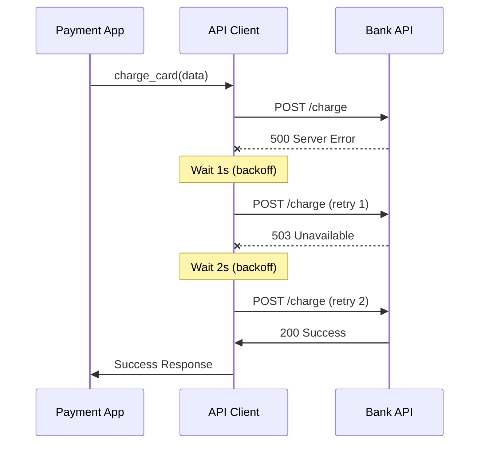
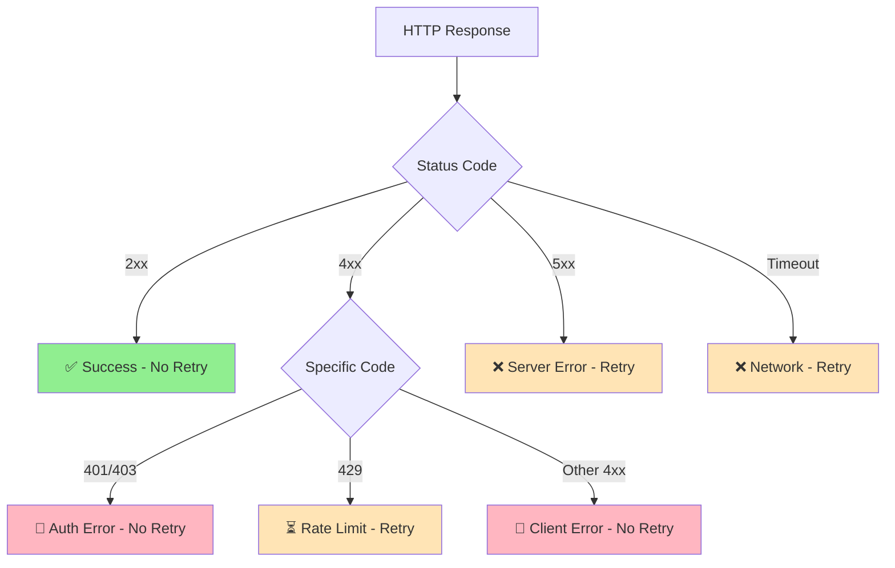
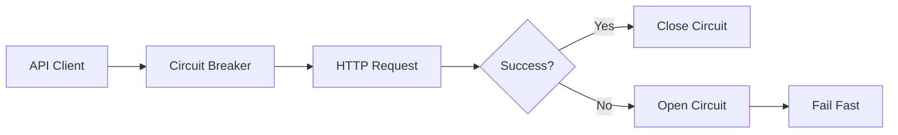

# API Client with Retries - Interview Guide

## Problem Statement
**Time**: 20-25 minutes  
**Difficulty**: Medium  
**Frequency**: 75%+ of payment company interviews

Design an HTTP client wrapper that reliably integrates with external payment APIs (banks, processors) using intelligent retry logic and error handling.

## Business Context
- Bank APIs are unreliable (maintenance, outages)
- Payment processors have rate limits
- Network issues cause transient failures
- Must distinguish retryable vs. permanent errors
- Compliance requires request/response logging

## System Overview



## Interview Approach

### Step 1: Clarify Requirements (3-4 minutes)

**Ask these questions:**
- What HTTP methods to support? (GET, POST, PUT, DELETE)
- Which errors should retry? (5xx yes, 4xx no, 429 rate limit yes)
- What retry strategy? (exponential backoff recommended)
- How many max retries? (typically 3-5)
- Need authentication handling?
- Request/response logging required?

### Step 2: Design Retry Strategy (3-4 minutes)

**Retry Decision Matrix:**



**Exponential Backoff:**
```
Attempt 1: Wait 1s
Attempt 2: Wait 2s  
Attempt 3: Wait 4s
Attempt 4: Wait 8s
Max delay: 30s
```

### Step 3: Design Core Classes (4-5 minutes)

```python
from enum import Enum
from dataclasses import dataclass
import time
import random
from typing import Dict, Optional, Any

class RetryStrategy(Enum):
    EXPONENTIAL_BACKOFF = "exponential"
    FIXED_DELAY = "fixed"
    LINEAR_BACKOFF = "linear"

@dataclass
class RetryConfig:
    max_attempts: int = 3
    strategy: RetryStrategy = RetryStrategy.EXPONENTIAL_BACKOFF
    base_delay_ms: int = 1000
    max_delay_ms: int = 30000
    backoff_multiplier: float = 2.0
    jitter: bool = True

@dataclass
class APIResponse:
    status_code: int
    headers: Dict[str, str]
    body: Optional[str]
    response_time_ms: int
    error: Optional[str] = None

class APIClient:
    def __init__(self, base_url: str, retry_config: RetryConfig = None):
        self.base_url = base_url.rstrip('/')
        self.retry_config = retry_config or RetryConfig()
        self.session_headers = {}
```

### Step 4: Implement HTTP Methods (6-8 minutes)

```python
def get(self, endpoint: str, headers: Dict[str, str] = None) -> APIResponse:
    """Make GET request with retries."""
    return self._make_request_with_retries("GET", endpoint, None, headers)

def post(self, endpoint: str, data: Dict = None, headers: Dict[str, str] = None) -> APIResponse:
    """Make POST request with retries."""
    return self._make_request_with_retries("POST", endpoint, data, headers)

def _make_request_with_retries(self, method: str, endpoint: str, 
                              data: Dict = None, headers: Dict[str, str] = None) -> APIResponse:
    """Core method with retry logic."""
    url = f"{self.base_url}/{endpoint.lstrip('/')}"
    merged_headers = {**self.session_headers, **(headers or {})}
    
    last_response = None
    
    for attempt in range(1, self.retry_config.max_attempts + 1):
        try:
            # Make HTTP request (simulated for interview)
            response = self._simulate_http_request(method, url, data, merged_headers)
            
            # Log request/response
            self._log_request(method, url, data, response, attempt)
            
            # Check if we should retry
            if not self._should_retry(response, attempt):
                return response
                
            last_response = response
            
            # Calculate delay before next attempt
            if attempt < self.retry_config.max_attempts:
                delay = self._calculate_delay(attempt)
                time.sleep(delay / 1000.0)  # Convert ms to seconds
                
        except Exception as e:
            # Handle network errors, timeouts
            error_response = APIResponse(
                status_code=0,
                headers={},
                body=None,
                response_time_ms=0,
                error=str(e)
            )
            
            if attempt == self.retry_config.max_attempts:
                return error_response
                
            # Wait before retry
            delay = self._calculate_delay(attempt)
            time.sleep(delay / 1000.0)
    
    return last_response

def _should_retry(self, response: APIResponse, attempt: int) -> bool:
    """Determine if request should be retried."""
    # Don't retry if we've hit max attempts
    if attempt >= self.retry_config.max_attempts:
        return False
    
    # Retry on server errors (5xx)
    if 500 <= response.status_code <= 599:
        return True
    
    # Retry on rate limiting
    if response.status_code == 429:
        return True
    
    # Retry on network errors
    if response.status_code == 0:  # Network error
        return True
    
    # Don't retry on client errors (4xx) except 429
    if 400 <= response.status_code <= 499:
        return False
    
    # Don't retry on success (2xx, 3xx)
    return False

def _calculate_delay(self, attempt: int) -> float:
    """Calculate delay before next retry attempt."""
    if self.retry_config.strategy == RetryStrategy.EXPONENTIAL_BACKOFF:
        delay = self.retry_config.base_delay_ms * (
            self.retry_config.backoff_multiplier ** (attempt - 1)
        )
        delay = min(delay, self.retry_config.max_delay_ms)
    elif self.retry_config.strategy == RetryStrategy.FIXED_DELAY:
        delay = self.retry_config.base_delay_ms
    else:  # LINEAR_BACKOFF
        delay = self.retry_config.base_delay_ms * attempt
    
    # Add jitter to prevent thundering herd
    if self.retry_config.jitter:
        delay = self._add_jitter(delay)
    
    return delay

def _add_jitter(self, delay_ms: float) -> float:
    """Add random jitter to prevent thundering herd."""
    # Add ±25% jitter
    jitter_range = delay_ms * 0.25
    jitter = random.uniform(-jitter_range, jitter_range)
    return max(0, delay_ms + jitter)
```

### Step 5: Implement Payment-Specific Client (4-5 minutes)

```python
class PaymentAPIClient(APIClient):
    """Specialized client for payment processor APIs."""
    
    def __init__(self, base_url: str, api_key: str, retry_config: RetryConfig = None):
        super().__init__(base_url, retry_config)
        self.api_key = api_key
        self.session_headers.update({
            "Authorization": f"Bearer {api_key}",
            "Content-Type": "application/json"
        })
    
    def charge_card(self, card_token: str, amount_cents: int, 
                   currency: str = "USD", idempotency_key: str = None) -> APIResponse:
        """Charge a credit card."""
        data = {
            "card_token": card_token,
            "amount": amount_cents,
            "currency": currency
        }
        
        headers = {}
        if idempotency_key:
            headers["Idempotency-Key"] = idempotency_key
        
        return self.post("/charges", data, headers)
    
    def refund_payment(self, payment_id: str, amount_cents: int = None) -> APIResponse:
        """Refund a payment (full or partial)."""
        data = {"payment_id": payment_id}
        if amount_cents:
            data["amount"] = amount_cents
        
        return self.post("/refunds", data)
    
    def get_payment_status(self, payment_id: str) -> APIResponse:
        """Get current status of a payment."""
        return self.get(f"/payments/{payment_id}")

def _simulate_http_request(self, method: str, url: str, data: Dict, 
                          headers: Dict) -> APIResponse:
    """Simulate HTTP request for interview purposes."""
    import random
    import time
    
    start_time = time.time()
    
    # Simulate network delay
    time.sleep(random.uniform(0.05, 0.2))
    
    # Simulate different response scenarios
    scenarios = [
        (200, '{"status": "success", "id": "pay_123"}', 0.7),  # 70% success
        (500, '{"error": "internal_server_error"}', 0.15),     # 15% server error
        (429, '{"error": "rate_limited"}', 0.05),              # 5% rate limit
        (401, '{"error": "unauthorized"}', 0.05),              # 5% auth error
        (0, None, 0.05)                                        # 5% network error
    ]
    
    # Choose scenario based on probabilities
    rand = random.random()
    cumulative = 0.0
    for status, body, prob in scenarios:
        cumulative += prob
        if rand <= cumulative:
            response_time = int((time.time() - start_time) * 1000)
            return APIResponse(
                status_code=status,
                headers={"Content-Type": "application/json"},
                body=body,
                response_time_ms=response_time,
                error="Network error" if status == 0 else None
            )
    
    # Fallback to success
    return APIResponse(200, {}, '{"status": "success"}', 100)

def _log_request(self, method: str, url: str, data: Dict, 
                response: APIResponse, attempt: int):
    """Log request/response for compliance and debugging."""
    # In production, use structured logging
    print(f"[Attempt {attempt}] {method} {url}")
    print(f"Request: {data}")
    print(f"Response: {response.status_code} - {response.body}")
    print(f"Time: {response.response_time_ms}ms")
    print("---")
```

## Advanced Features

### Circuit Breaker Integration


### Rate Limiting Awareness
```python
def _handle_rate_limit(self, response: APIResponse) -> float:
    """Extract retry-after from rate limit response."""
    if response.status_code == 429:
        retry_after = response.headers.get("Retry-After", "60")
        return float(retry_after) * 1000  # Convert to ms
    return self._calculate_delay(1)  # Default backoff
```

## Common Interview Questions

**Q: How do you handle rate limiting from external APIs?**
A: Check for 429 status and Retry-After header, respect the wait time before retrying.

**Q: What errors should you retry vs. fail immediately?**
A: Retry: 5xx server errors, timeouts, 429 rate limits. Don't retry: 4xx client errors (except 429), auth failures.

**Q: How do you prevent thundering herd when retrying?**
A: Add random jitter (±25%) to backoff delays so clients don't retry simultaneously.

**Q: How would you implement request deduplication?**
A: Use idempotency keys in headers, hash request content for automatic key generation.

**Q: How do you handle authentication token refresh?**
A: Intercept 401 responses, refresh token, retry original request with new token.

## Implementation Checklist

- [ ] Support all major HTTP methods (GET, POST, PUT, DELETE)
- [ ] Implement exponential backoff with jitter
- [ ] Smart retry logic based on HTTP status codes
- [ ] Request/response logging for compliance
- [ ] Timeout handling and connection pooling
- [ ] Idempotency key support for payment operations
- [ ] Circuit breaker integration for failing services
- [ ] Authentication token management

## Time Management Tips

- **Minutes 0-4**: Requirements clarification and retry strategy
- **Minutes 4-10**: Core APIClient with retry logic
- **Minutes 10-16**: Payment-specific methods and simulation
- **Minutes 16-20**: Advanced features and edge cases
- **Minutes 20-25**: Questions and production considerations

**Pro Tip**: Start with the retry decision matrix - it shows you understand the nuances of when to retry vs. fail fast, which is critical for payment systems!