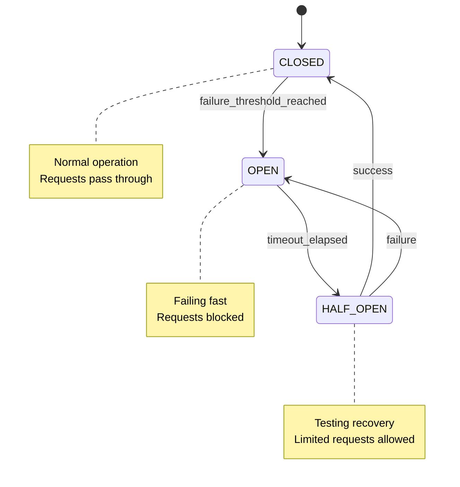
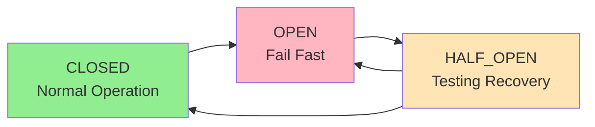
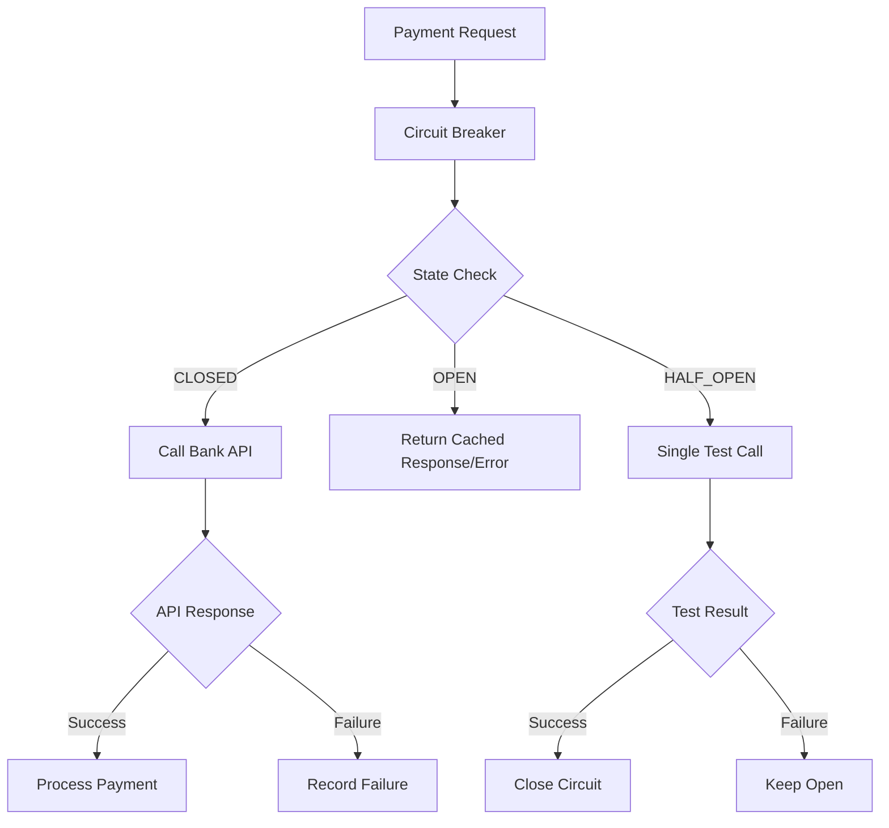

# Circuit Breaker - Interview Guide

## Problem Statement

**Time**: 15-20 minutes  
**Difficulty**: Easy-Medium  
**Frequency**: 70%+ of payment company interviews

Design a circuit breaker to protect your payment system from cascading failures when external services (banks, payment
processors) become unavailable.

## Business Context

- Bank APIs go down during maintenance
- Payment processors have outages
- Prevent request pile-up and timeouts
- Fail fast instead of waiting
- Automatic recovery when service returns

## System Overview



## Interview Approach

### Step 1: Clarify Requirements (2-3 minutes)

**Ask these questions:**

- What triggers circuit opening? (failure count, error rate, timeout)
- How long to stay open? (recovery timeout)
- How to test recovery? (half-open state)
- What counts as failure? (HTTP 5xx, timeouts, exceptions)
- Thread safety needed?

### Step 2: Design State Machine (3-4 minutes)

**Three States:**



**State Transitions:**

- CLOSED → OPEN: Too many failures
- OPEN → HALF_OPEN: Timeout expires
- HALF_OPEN → CLOSED: Test request succeeds
- HALF_OPEN → OPEN: Test request fails

### Step 3: Design Data Structures (3-4 minutes)

```python
from enum import Enum
from datetime import datetime, timedelta
import threading


class CircuitState(Enum):
    CLOSED = "closed"
    OPEN = "open"
    HALF_OPEN = "half_open"


class CircuitBreaker:
    def __init__(self, failure_threshold=5, recovery_timeout=60):
        self.failure_threshold = failure_threshold
        self.recovery_timeout = recovery_timeout
        self.failure_count = 0
        self.last_failure_time = None
        self.state = CircuitState.CLOSED
        self.lock = threading.Lock()
```

### Step 4: Implement Core Logic (8-10 minutes)

```python
def call(self, func, *args, **kwargs):
    """Execute function with circuit breaker protection"""
    with self.lock:
        # Check if we can make the call
        if not self._can_execute():
            raise CircuitBreakerOpenException("Circuit breaker is OPEN")

        # Update state before call
        self._update_state()

    try:
        # Make the actual call
        result = func(*args, **kwargs)
        self._on_success()
        return result
    except Exception as e:
        self._on_failure()
        raise


def _can_execute(self) -> bool:
    """Check if we can execute the call"""
    if self.state == CircuitState.CLOSED:
        return True
    elif self.state == CircuitState.OPEN:
        return False
    elif self.state == CircuitState.HALF_OPEN:
        # Only allow one test call
        return True


def _update_state(self):
    """Update circuit breaker state"""
    if self.state == CircuitState.OPEN:
        # Check if we should transition to HALF_OPEN
        if self._should_attempt_reset():
            self.state = CircuitState.HALF_OPEN


def _should_attempt_reset(self) -> bool:
    """Check if enough time has passed to attempt reset"""
    if self.last_failure_time is None:
        return False

    recovery_time = self.last_failure_time + timedelta(seconds=self.recovery_timeout)
    return datetime.now() >= recovery_time


def _on_success(self):
    """Handle successful call"""
    with self.lock:
        if self.state == CircuitState.HALF_OPEN:
            # Recovery successful, close circuit
            self.state = CircuitState.CLOSED
            self.failure_count = 0
            self.last_failure_time = None


def _on_failure(self):
    """Handle failed call"""
    with self.lock:
        self.failure_count += 1
        self.last_failure_time = datetime.now()

        if self.state == CircuitState.HALF_OPEN:
            # Test failed, go back to OPEN
            self.state = CircuitState.OPEN
        elif (self.state == CircuitState.CLOSED and
              self.failure_count >= self.failure_threshold):
            # Too many failures, open circuit
            self.state = CircuitState.OPEN
```

### Step 5: Handle Edge Cases (3-4 minutes)

**Advanced Features:**

```python
def _calculate_failure_rate(self) -> float:
    """Calculate failure rate over sliding window"""
    if len(self.request_log) == 0:
        return 0.0

    failures = sum(1 for success in self.request_log if not success)
    return failures / len(self.request_log)
```

## Integration with Payment Systems



## Common Interview Questions

**Q: How do you prevent the thundering herd problem?**
A: Use exponential backoff for recovery timeout, or add jitter to recovery times.

**Q: What if the service recovers but then fails again immediately?**
A: Require multiple consecutive successes before fully closing the circuit.

**Q: How do you handle partial failures?**
A: Use failure rate over sliding window instead of simple failure count.

**Q: Should timeouts count as failures?**
A: Yes, but distinguish between connection timeouts (fail fast) and read timeouts (may retry).

## Implementation Checklist

- [ ] Define clear state machine with three states
- [ ] Implement thread-safe state transitions
- [ ] Handle both failure count and failure rate triggers
- [ ] Add proper timeout handling for recovery
- [ ] Include monitoring and metrics
- [ ] Consider fallback strategies when circuit is open
- [ ] Test edge cases (concurrent access, time changes)

## Time Management Tips

- **Minutes 0-3**: Requirements and state machine design
- **Minutes 3-8**: Basic three-state implementation
- **Minutes 8-12**: Error handling and edge cases
- **Minutes 12-16**: Advanced features (failure rate, monitoring)
- **Minutes 16-20**: Integration patterns and questions

**Pro Tip**: Draw the state diagram first! It makes the implementation obvious and shows you understand the pattern.