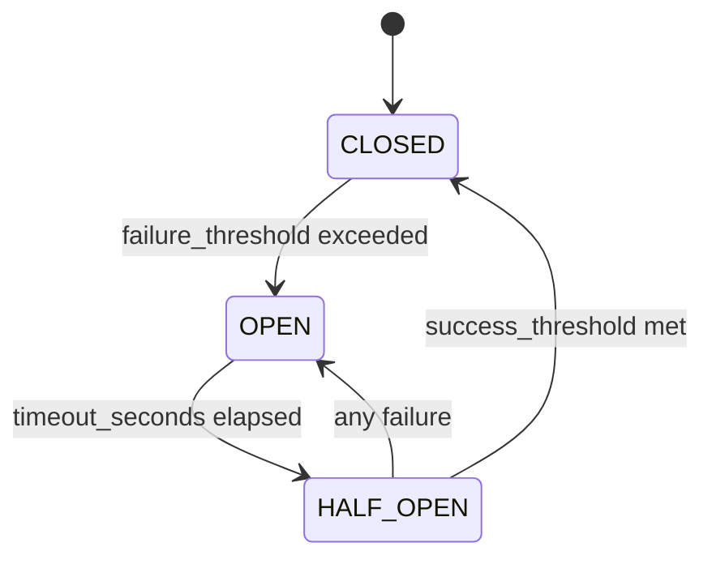
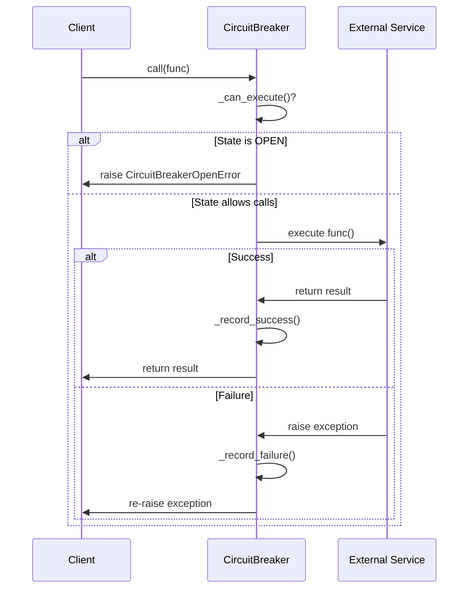

# ⚡ Understanding Circuit Breaker Pattern with Analogies & Diagrams

## 🎯 Goal

Design a circuit breaker for external service calls that:

* Has **3 states**: CLOSED, OPEN, HALF_OPEN
* **Fails fast** when service is down
* **Auto-recovers** when service is healthy
* Provides **thread-safe** protection
* Tracks **metrics**

---

## 🏠 Real-World Analogy

### Imagine: A house electrical circuit breaker

* **CLOSED**: Normal operation - electricity flows freely
* **OPEN**: Circuit tripped - no electricity flows (protection mode)
* **HALF_OPEN**: Testing mode - cautiously trying one appliance

When too many devices overload the circuit (failures), the breaker **trips** to protect the house. After some time, you **test** if it's safe to reset.

---

## 🔄 State Machine



### State Behaviors:

* **CLOSED**: All calls allowed, counting failures
* **OPEN**: All calls rejected immediately, waiting for timeout
* **HALF_OPEN**: Limited calls allowed to test service recovery

---

## 📊 Core Data Structures

### 1. `CircuitBreakerConfig`
```python
@dataclass
class CircuitBreakerConfig:
    failure_threshold: int = 3    # Failures before opening
    timeout_seconds: int = 5      # Time before trying HALF_OPEN
    success_threshold: int = 2    # Successes before closing
```

### 2. `CallResult`
```python
@dataclass
class CallResult:
    success: bool
    response_time_ms: float
    error_message: Optional[str]
    timestamp: datetime
```

---

## 🚀 Circuit Operations

### ⚡ `call(func, *args, **kwargs)`

Main entry point that wraps external service calls:



---

### 🔍 `_can_execute()`

Determines if calls are allowed based on current state:

```python
def _can_execute(self) -> bool:
    if state == CLOSED or state == HALF_OPEN:
        return True
    elif state == OPEN:
        if timeout_expired:
            state = HALF_OPEN
            return True
        return False
```

---

## 📈 State Transitions

### 🔴 CLOSED → OPEN
```python
def _record_failure(self, error, response_time):
    self.failure_count += 1
    if self.failure_count >= self.config.failure_threshold:
        self.state = CircuitState.OPEN
        self.last_failure_time = datetime.now()
```

### 🟡 OPEN → HALF_OPEN
```python
def _should_attempt_reset(self) -> bool:
    return (datetime.now() - self.last_failure_time).total_seconds() >= self.config.timeout_seconds
```

### 🟢 HALF_OPEN → CLOSED
```python
def _record_success(self, response_time):
    if self.state == CircuitState.HALF_OPEN:
        self.success_count += 1
        if self.success_count >= self.config.success_threshold:
            self.state = CircuitState.CLOSED
            self._reset_counters()
```

---

## 🧪 Example Flow

```python
cb = CircuitBreaker("payments", CircuitBreakerConfig(
    failure_threshold=3, 
    timeout_seconds=5,
    success_threshold=2
))

# Normal operation (CLOSED)
cb.call(payment_service, "txn_1")  # ✅ Success
cb.call(payment_service, "txn_2")  # ❌ Fail (1/3)
cb.call(payment_service, "txn_3")  # ❌ Fail (2/3)
cb.call(payment_service, "txn_4")  # ❌ Fail (3/3) → OPEN

# Circuit is now OPEN
cb.call(payment_service, "txn_5")  # 🚫 CircuitBreakerOpenError

# Wait 5 seconds...
time.sleep(5)

# Circuit moves to HALF_OPEN
cb.call(payment_service, "txn_6")  # ✅ Success (1/2)
cb.call(payment_service, "txn_7")  # ✅ Success (2/2) → CLOSED
```

---

## 🔒 Thread Safety

All state modifications are protected with `threading.Lock()`:

```python
def _record_success(self, response_time_ms: float) -> None:
    with self.lock:  # 🔒 Thread-safe
        self.history.append(CallResult(True, response_time_ms))
        # ... state transitions
```

---

## 📊 Metrics & Monitoring

### `get_stats()` returns:
```python
{
    "state": "open",
    "failures": 3,
    "successes": 0,
    "total_calls": 7
}
```

---

## 🧠 Interview Power Tips

* **Fail Fast**: Circuit breaker prevents cascading failures
* **Bulkhead Pattern**: Isolate failures to protect other systems
* **Exponential Backoff**: Could enhance with increasing timeouts
* **Health Checks**: HALF_OPEN state is like a health check probe
* **Metrics**: Essential for monitoring and alerting
* **Fallback**: Consider what to return when circuit is OPEN

---

## 🔥 Advanced Features

* **Rolling Window**: Track failures over time windows
* **Partial Failures**: Handle timeouts differently than errors
* **Multiple Thresholds**: Different thresholds for different error types
* **Circuit Groups**: Share state across multiple circuit instances