# Rate Limiter Implementation

## 🎯 Problem Overview

Rate limiting is a fundamental technique to control the number of requests a user can make to an API within a specific time window. It's essential for preventing abuse, ensuring fair usage, and maintaining system stability.

## 🎨 Visual Architecture

### Sliding Window Rate Limiter


### Token Bucket Rate Limiter

```mermaid
graph TB
    A[Request Arrives] --> B[Check Bucket]
    B --> C[Refill Tokens Based on Time]
    C --> D{Tokens Available?}
    D -->|Yes| E[Consume Token]
    D -->|No| F[Reject Request]
    E --> G[Process Request]
    F --> H[Return Rate Limited]
    
    subgraph "Token Bucket"
    I[🪣 Bucket<br/>Capacity: 10<br/>Current: 7<br/>Refill: 2/sec]
    end
    
    subgraph "Token Flow"
    J[⏰ Timer] --> K[Add Tokens]
    K --> I
    L[📥 Request] --> M[Remove Token]
    M --> I
    end
```


## 🔑 Key Concepts

### 1. Sliding Window Algorithm
- **Time Complexity**: O(log n) for cleanup, O(1) for check
- **Space Complexity**: O(n) where n is number of requests in window
- **Best For**: Smooth, consistent rate limiting

```mermaid
timeline
    title Sliding Window (5 requests/10 seconds)
    
    section Time: 0-10s
        Request 1 : 2s
        Request 2 : 4s
        Request 3 : 6s
        Request 4 : 8s
        Request 5 : 9s
    
    section Time: 5-15s  
        Window Slides : Requests 1,2 expire
        Request 6 : 12s (Allowed)
        Request 7 : 13s (Allowed)
        Request 8 : 14s (Rejected - would exceed 5 in window)
```

### 2. Token Bucket Algorithm
- **Time Complexity**: O(1)
- **Space Complexity**: O(1) per bucket
- **Best For**: Handling bursty traffic

```mermaid
graph LR
    A[🪣 Empty Bucket<br/>Tokens: 0/10] --> B[⏰ 5 seconds pass<br/>+10 tokens]
    B --> C[🪣 Full Bucket<br/>Tokens: 10/10]
    C --> D[📥 Burst: 8 requests<br/>-8 tokens]
    D --> E[🪣 Partial Bucket<br/>Tokens: 2/10]
    E --> F[⏰ 1 second pass<br/>+2 tokens]
    F --> G[🪣 Partial Bucket<br/>Tokens: 4/10]
```



## 🏗️ Implementation Strategy

### Phase 1: Basic Implementation
```python
# 1. Start with simple in-memory storage
# 2. Implement core algorithm logic
# 3. Basic thread safety with locks
```

### Phase 2: Advanced Features
```python
# 1. Add cleanup mechanisms
# 2. Implement statistics collection
# 3. Handle edge cases (clock skew, etc.)
```

### Phase 3: Production Ready
```python
# 1. Distributed rate limiting with Redis
# 2. Performance optimizations
# 3. Monitoring and alerting
```

## 🧪 Test Strategy


## 💡 Interview Discussion Points

### Algorithm Comparison
| Aspect | Sliding Window | Token Bucket |
|--------|---------------|--------------|
| **Memory** | O(n) requests | O(1) per user |
| **Burst Handling** | Strict | Allows bursts |
| **Implementation** | Complex | Simple |
| **Use Case** | Smooth rate | Bursty traffic |

### Common Questions
1. **"How do you handle distributed rate limiting?"**
   - Use Redis with atomic operations
   - Implement sliding window with sorted sets
   - Handle network partitions gracefully

2. **"What about clock skew in distributed systems?"**
   - Use logical timestamps
   - Implement drift tolerance
   - Synchronize clocks via NTP

3. **"How do you clean up expired entries?"**
   - Background cleanup threads
   - Lazy cleanup on access
   - TTL-based expiration

## 🎯 Real-World Applications

### API Gateway Rate Limiting


### User-Specific Rate Limiting


## 🔧 Implementation Files

- **`rate_limiter.py`** - Core implementation with TODO markers
- **`test_rate_limiter.py`** - Comprehensive test suite

## 🚀 Getting Started

```bash
# Run tests to understand expected behavior
pytest test_rate_limiter.py -v

# Implement step by step
# 1. Start with SlidingWindowRateLimiter.__init__
# 2. Implement is_allowed method
# 3. Add cleanup logic
# 4. Make thread-safe
# 5. Optimize performance

# Test your implementation
pytest test_rate_limiter.py::TestSlidingWindowRateLimiter -v
```

## 🏆 Success Criteria

After completing this challenge, you should be able to:
- ✅ Explain sliding window vs token bucket trade-offs
- ✅ Implement thread-safe rate limiting
- ✅ Handle distributed rate limiting scenarios
- ✅ Optimize for high-throughput systems
- ✅ Debug rate limiting edge cases in production