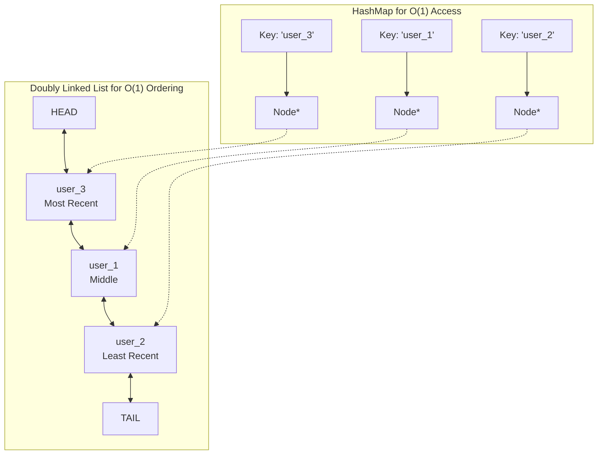
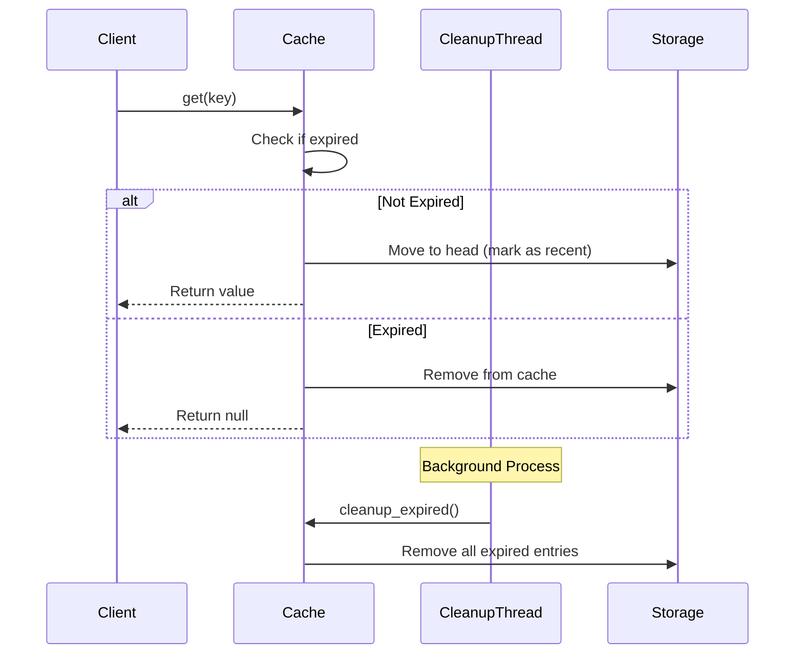
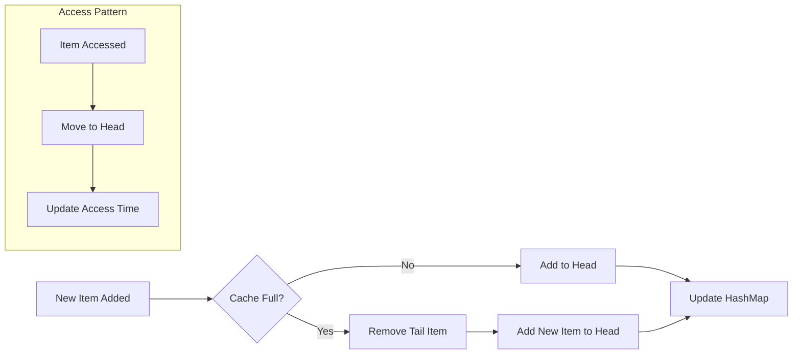
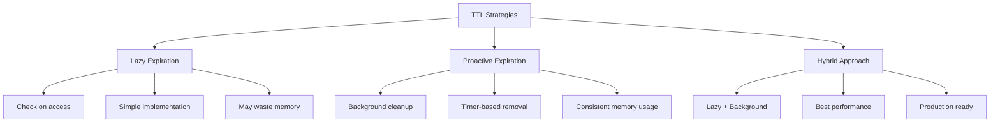
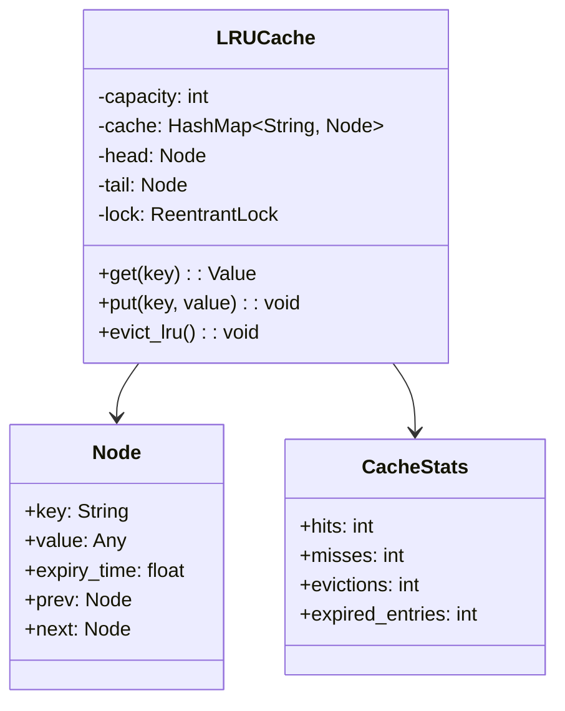
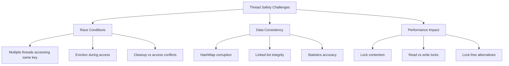
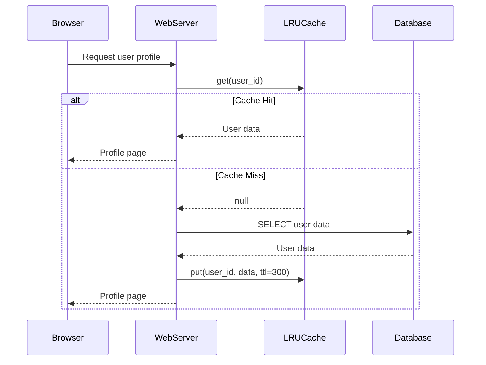
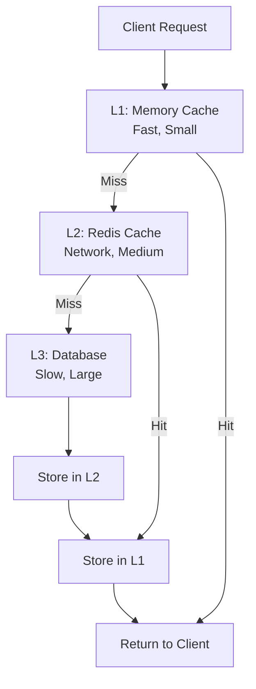
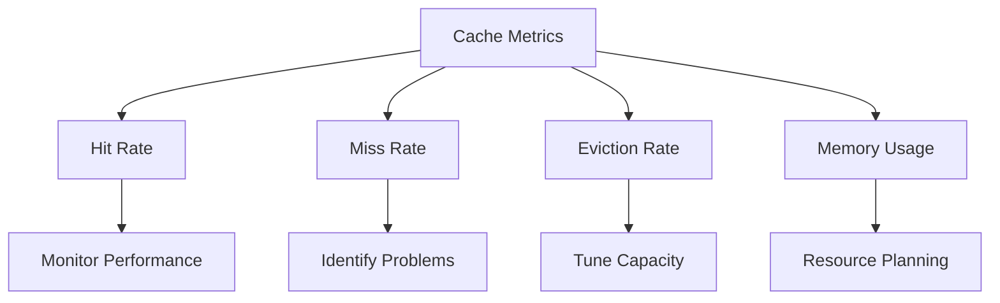

# LRU Cache with TTL Implementation

## 🎯 Problem Overview

An LRU (Least Recently Used) cache with TTL (Time To Live) combines efficient caching with automatic expiration. It's one of the most common interview questions because it tests your understanding of data structures, algorithms, and real-world system design.

## 🎨 Visual Architecture

### LRU Cache Data Structure


### TTL Expiration Flow


## 🔑 Key Concepts

### 1. LRU Eviction Policy


### 2. TTL Implementation Strategies


## 🏗️ Implementation Deep Dive

### Data Structure Choice


### Thread Safety Considerations


## 🧪 Test Strategy

### Test Categories
```mermaid
mindmap
  root((LRU Cache Tests))
    Basic Operations
      Get/Put functionality
      Capacity enforcement
      LRU eviction order
    TTL Features
      Expiration behavior
      Custom TTL override
      Cleanup efficiency
    Thread Safety
      Concurrent access
      Race condition prevention
      Data consistency
    Performance
      O(1) operation verification
      Memory usage patterns
      High throughput scenarios
    Edge Cases
      Empty cache
      Single item cache
      Clock adjustments
```

## 💡 Interview Discussion Points

### Common Questions & Answers

**Q: "Why use HashMap + Doubly Linked List?"**
```mermaid
graph LR
    A[HashMap Only] --> A1[❌ No ordering info]
    B[Array Only] --> B1[❌ O(n) search]
    C[Linked List Only] --> C1[❌ O(n) access]
    D[HashMap + DLL] --> D1[✅ O(1) access + ordering]
```

**Q: "How do you handle TTL efficiently?"**
- **Lazy Expiration**: Check on access (simple, may waste memory)
- **Active Expiration**: Background cleanup (complex, memory efficient)
- **Hybrid**: Both approaches (production ready)

**Q: "What about thread safety?"**
```python
# Read-Write Lock Strategy
class ThreadSafeLRUCache:
    def __init__(self):
        self.read_lock = threading.RLock()
        self.write_lock = threading.RLock()
    
    def get(self, key):
        with self.read_lock:
            # Check expiration, update position
    
    def put(self, key, value):
        with self.write_lock:
            # Add/update entry, handle eviction
```

### Time & Space Complexity
| Operation | Time | Space | Notes |
|-----------|------|-------|-------|
| **get()** | O(1) | - | HashMap lookup + DLL move |
| **put()** | O(1) | - | HashMap insert + DLL operations |
| **cleanup()** | O(n) | - | Scan all entries for expiration |
| **Overall** | - | O(capacity) | HashMap + DLL storage |

## 🎯 Real-World Applications

### Web Application Cache


### Multi-Level Caching


## 🔧 Advanced Features

### Cache Warming


### Cache Statistics


## 🚀 Implementation Guide

### Step-by-Step Approach
1. **Basic LRU** - HashMap + Doubly Linked List
2. **Add TTL** - Expiration timestamps
3. **Thread Safety** - Locks and synchronization
4. **Optimization** - Background cleanup, statistics
5. **Advanced** - Cache warming, multi-level

### Testing Your Implementation
```bash
# Run basic functionality tests
pytest test_lru_cache.py::TestLRUCache::test_basic_operations -v

# Test TTL features
pytest test_lru_cache.py::TestTTLFunctionality -v

# Verify thread safety
pytest test_lru_cache.py::TestThreadSafety -v

# Performance benchmarks
pytest test_lru_cache.py::TestPerformance -v
```

## 🏆 Success Criteria

After completing this challenge:
- ✅ Understand why HashMap + DLL is the optimal choice
- ✅ Implement O(1) get/put operations correctly
- ✅ Handle TTL with multiple strategies
- ✅ Make cache thread-safe without sacrificing performance
- ✅ Add comprehensive monitoring and statistics
- ✅ Explain trade-offs between different caching strategies