# Producer-Consumer with Bounded Buffer

## 🎯 Problem Overview

The Producer-Consumer pattern is fundamental to concurrent programming and distributed systems. It demonstrates how to coordinate multiple threads, handle backpressure, and implement graceful shutdown - all critical skills for backend engineers.

## 🎨 Visual Architecture

### Classic Producer-Consumer Setup
```mermaid
graph TD
    subgraph "Producers"
    P1[Producer 1<br/>Generate Items]
    P2[Producer 2<br/>Generate Items]
    P3[Producer 3<br/>Generate Items]
    end
    
    subgraph "Bounded Buffer"
    B[🗃️ Buffer<br/>Capacity: 10<br/>Current: 7<br/>Strategy: FIFO]
    end
    
    subgraph "Consumers"
    C1[Consumer 1<br/>Process Items]
    C2[Consumer 2<br/>Process Items]
    end
    
    P1 -->|put()| B
    P2 -->|put()| B
    P3 -->|put()| B
    
    B -->|get()| C1
    B -->|get()| C2
```

### Buffer Strategies Comparison
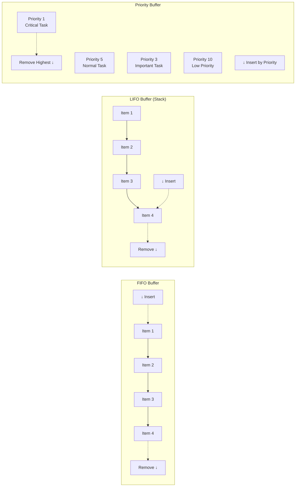

## 🔑 Key Concepts

### Synchronization Primitives
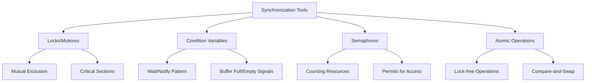

### Bounded Buffer States
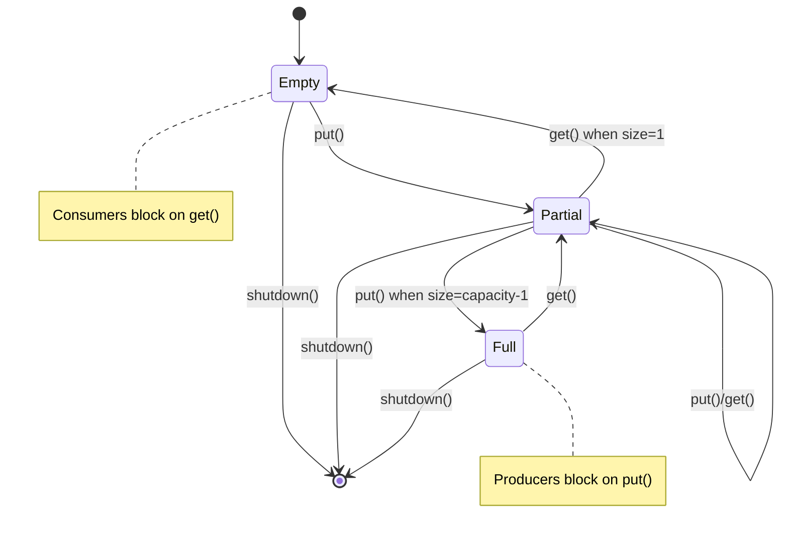

## 🏗️ Implementation Strategies

### Thread Safety with Locks
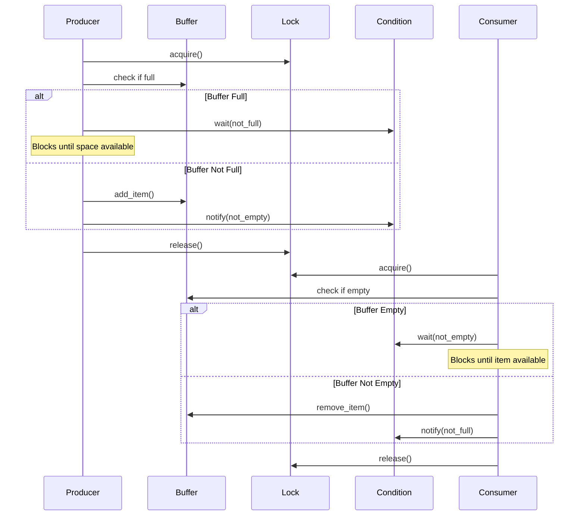

### Backpressure Handling
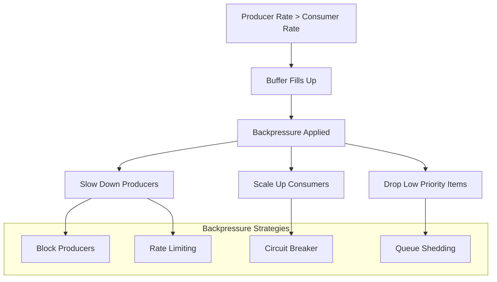

## 🧪 Test Strategy

### Concurrency Testing Approach
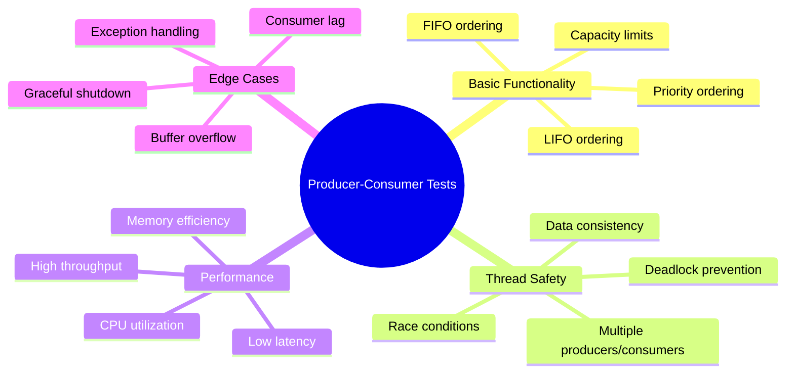

### Testing Scenarios
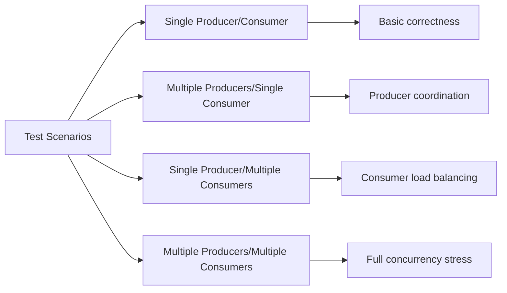

## 💡 Interview Discussion Points

### Common Questions

**Q: "How do you prevent deadlocks?"**
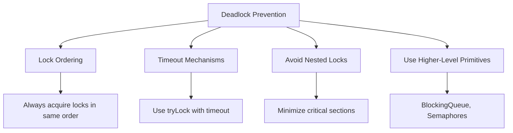

**Q: "What happens when consumers are slower than producers?"**
- **Bounded Buffer**: Producers block when buffer is full
- **Backpressure**: Apply rate limiting to producers
- **Load Balancing**: Add more consumers dynamically
- **Priority Dropping**: Drop low-priority items

**Q: "How do you handle graceful shutdown?"**
```python
class GracefulShutdown:
    def __init__(self):
        self.shutdown_flag = threading.Event()
    
    def shutdown(self):
        self.shutdown_flag.set()
        # Wake up all waiting threads
        self.not_empty.notify_all()
        self.not_full.notify_all()
    
    def is_shutdown(self):
        return self.shutdown_flag.is_set()
```

### Performance Considerations
| Aspect | FIFO Queue | Priority Queue | Work Stealing |
|--------|------------|----------------|---------------|
| **Insertion** | O(1) | O(log n) | O(1) amortized |
| **Removal** | O(1) | O(log n) | O(1) amortized |
| **Ordering** | Strict FIFO | By priority | Load balanced |
| **Use Case** | Standard pipeline | Task prioritization | CPU-intensive work |

## 🎯 Real-World Applications

### Web Server Request Processing
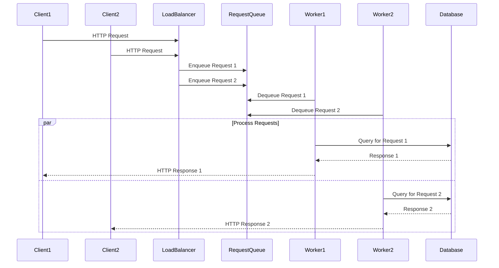

### Message Processing Pipeline
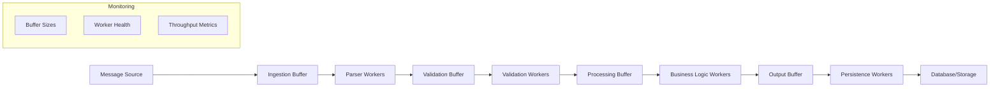

## 🔧 Advanced Patterns

### Work Stealing
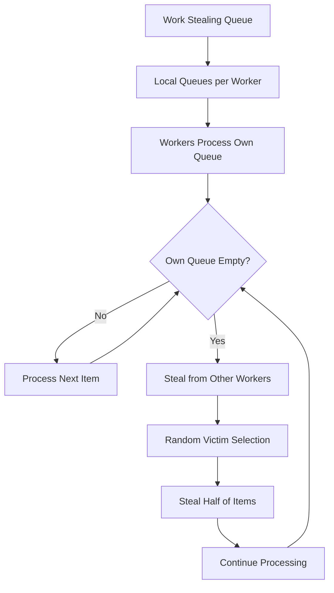

### Batch Processing
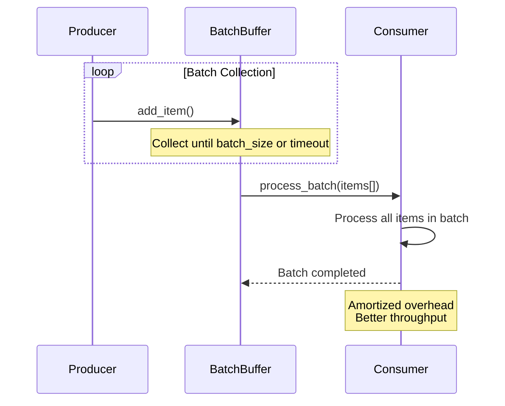

## 🚀 Implementation Guide

### Phase 1: Basic Buffer
```python
# Start with simple FIFO buffer
# Add basic put/get operations
# Implement capacity checking
```

### Phase 2: Thread Safety
```python
# Add locks and condition variables
# Handle blocking operations
# Prevent race conditions
```

### Phase 3: Advanced Features
```python
# Multiple buffer strategies (FIFO, LIFO, Priority)
# Graceful shutdown mechanism
# Statistics and monitoring
```

### Phase 4: Production Ready
```python
# Backpressure handling
# Work stealing variant
# Performance optimizations
```

## 🧪 Testing Your Implementation

```bash
# Test basic functionality
pytest test_producer_consumer.py::TestBoundedBuffer -v

# Test thread safety
pytest test_producer_consumer.py::TestConcurrency -v

# Test different strategies
pytest test_producer_consumer.py::TestBufferStrategies -v

# Performance benchmarks
pytest test_producer_consumer.py::TestPerformance -v
```

## 🏆 Success Criteria

After completing this challenge:
- ✅ Understand synchronization primitives deeply
- ✅ Implement deadlock-free concurrent systems
- ✅ Handle backpressure and load balancing
- ✅ Design graceful shutdown mechanisms
- ✅ Optimize for high-throughput scenarios
- ✅ Debug complex concurrency issues
- ✅ Apply patterns to real-world distributed systems