# Background Job Processing System

## 🎯 Problem Overview

A robust job processing system is the backbone of modern scalable applications. It handles background tasks, manages priorities, implements retry logic, and ensures no work is lost. This challenge tests your ability to design fault-tolerant distributed systems.

## 🎨 Visual Architecture

### Job Processing Flow


### Job Lifecycle States


## 🔑 Key Concepts

### Priority Queue with Job Scheduling

```mermaid
graph TB
    subgraph "Job Priority Queue"
    A[🔴 Critical: Priority 0<br/>System alerts, payments]
    B[🟠 High: Priority 1-3<br/>User requests, notifications]
    C[🟡 Normal: Priority 4-6<br/>Data processing, reports]
    D[🟢 Low: Priority 7-10<br/>Cleanup, analytics]
    end
    
    E[Worker Pool] --> A
    A --> F[Next Available Worker]
    E --> B
    E --> C
    E --> D
    
    G[Scheduler] --> H[Check Delayed Jobs]
    H --> I{Ready to Run?}
    I -->|Yes| B
    I -->|No| J[Keep in Schedule]
```


### Retry Strategies


## 🏗️ System Architecture

### Worker Pool Management


### Job Persistence and Recovery


## 🧪 Test Strategy

### Testing Pyramid


### Failure Scenarios


## 💡 Interview Discussion Points

### Common Questions

**Q: "How do you ensure no jobs are lost?"**


**Q: "How do you handle job dependencies?"**
```python
# Job Dependency Graph
class JobDependency:
    def __init__(self):
        self.dependencies = {}  # job_id -> [prerequisite_job_ids]
        self.dependents = {}    # job_id -> [dependent_job_ids]
    
    def add_dependency(self, job_id, prerequisite_id):
        # Job can only run after prerequisite completes
        pass
    
    def job_completed(self, job_id):
        # Check if any dependent jobs can now run
        pass
```

**Q: "How do you scale the system?"**
| Scaling Dimension | Strategy | Implementation |
|------------------|----------|----------------|
| **Horizontal** | More worker nodes | Container orchestration |
| **Vertical** | Bigger machines | Resource allocation |
| **Queue Partitioning** | Shard by job type | Multiple queue instances |
| **Database** | Read replicas | Query optimization |

### Performance Optimization


## 🎯 Real-World Applications

### E-commerce Order Processing


### Data Pipeline Processing


## 🔧 Advanced Features

### Job Scheduling Patterns

```mermaid
graph TB
    A[Scheduling Patterns] --> B[Cron Jobs<br/>Recurring schedules]
    A --> C[Delayed Jobs<br/>Future execution]
    A --> D[Chained Jobs<br/>Sequential dependencies]
    A --> E[Parallel Jobs<br/>Concurrent execution]
    
    B --> B1["0 0 * * * - Daily at midnight"]
    C --> C1["Execute in 1 hour"]
    D --> D1["Job A → Job B → Job C"]
    E --> E1["Jobs A, B, C run together"]
```


### Monitoring and Observability


## 🚀 Implementation Guide

### Phase 1: Core Job Queue
```python
# 1. Basic job creation and storage
# 2. Priority queue implementation
# 3. Simple worker execution
```

### Phase 2: Reliability
```python
# 1. Job persistence to database
# 2. Retry mechanisms with backoff
# 3. Worker failure handling
```

### Phase 3: Scaling
```python
# 1. Worker pool management
# 2. Job scheduling and delays
# 3. Performance optimizations
```

### Phase 4: Production Ready
```python
# 1. Comprehensive monitoring
# 2. Job dependencies
# 3. Auto-scaling capabilities
```

## 🧪 Testing Your Implementation

```bash
# Test basic job processing
pytest test_job_queue.py::TestJobQueue -v

# Test retry mechanisms
pytest test_job_queue.py::TestRetryStrategies -v

# Test worker pool management
pytest test_job_queue.py::TestWorkerPool -v

# Performance and reliability tests
pytest test_job_queue.py::TestPerformance -v
pytest test_job_queue.py::TestJobPersistence -v
```

## 🏆 Success Criteria

After completing this challenge:
- ✅ Design fault-tolerant distributed job systems
- ✅ Implement sophisticated retry strategies
- ✅ Handle worker failures gracefully
- ✅ Build scalable worker pool management
- ✅ Create comprehensive monitoring systems
- ✅ Optimize for high-throughput job processing
- ✅ Understand job scheduling patterns and dependencies