# Distributed Hash Table (DHT)

## 🎯 Problem Overview

A Distributed Hash Table is the foundation of many large-scale systems like Amazon DynamoDB, Apache Cassandra, and BitTorrent. It demonstrates how to build scalable, fault-tolerant distributed systems that can handle node failures, network partitions, and maintain data consistency.

## 🎨 Visual Architecture

### DHT Ring Topology
```mermaid
graph LR
    subgraph "Consistent Hash Ring"
    A[Node A<br/>Hash: 0-63] --> B[Node B<br/>Hash: 64-127]
    B --> C[Node C<br/>Hash: 128-191]
    C --> D[Node D<br/>Hash: 192-255]
    D --> A
    end
    
    E[Key: "user_123"<br/>Hash: 145] -.-> C
    F[Key: "file_456"<br/>Hash: 45] -.-> A
    G[Key: "data_789"<br/>Hash: 200] -.-> D
    
    H[Client] --> I[Any Node]
    I --> J[Route to Responsible Node]
```

### Data Replication Strategy
```mermaid
graph TD
    A[Key: "user_data"<br/>Hash: 150] --> B[Primary Node C<br/>Hash Range: 128-191]
    
    B --> C[Replica 1: Node D<br/>Next clockwise]
    B --> D[Replica 2: Node A<br/>Next clockwise]
    
    E[Write Request] --> F[Coordinate Write]
    F --> G[Send to Replicas]
    G --> H{Quorum Achieved?}
    H -->|Yes| I[Acknowledge Success]
    H -->|No| J[Return Failure]
    
    K[Read Request] --> L[Read from Replicas]
    L --> M[Compare Versions]
    M --> N[Return Latest Value]
```

## 🔑 Key Concepts

### Consistent Hashing Deep Dive
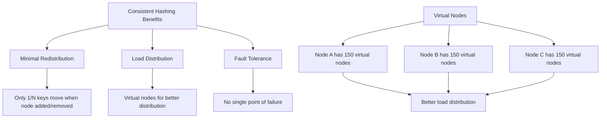

### CAP Theorem Trade-offs
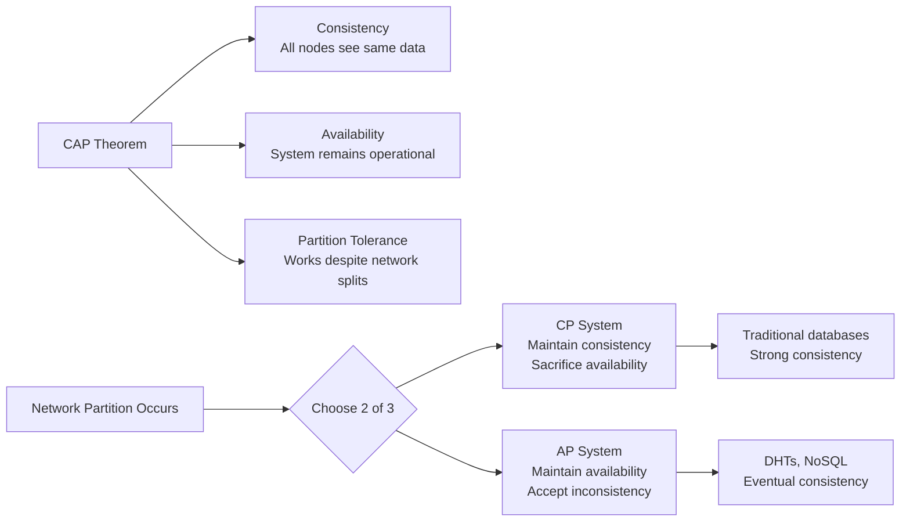

### Node Join/Leave Protocol
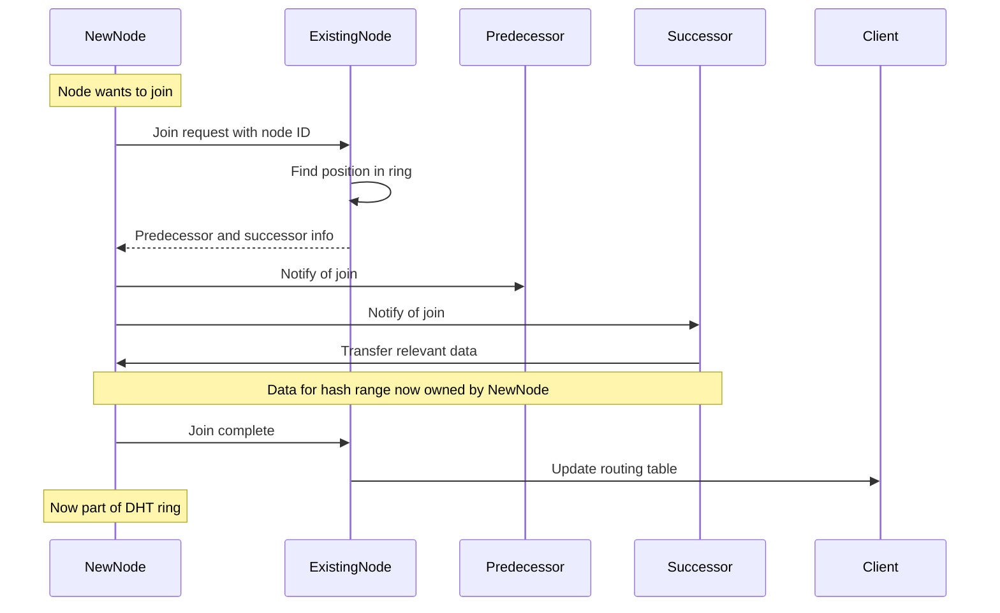

## 🏗️ System Architecture

### DHT Node Components
```mermaid
graph TD
    A[DHT Node] --> B[Routing Table<br/>Finger table for O(log N) lookups]
    A --> C[Local Storage<br/>Key-value pairs for owned range]
    A --> D[Replication Manager<br/>Handle replica coordination]
    A --> E[Failure Detector<br/>Monitor other nodes]
    A --> F[Network Layer<br/>Inter-node communication]
    
    G[Client Interface] --> H[PUT operations]
    G --> I[GET operations]
    G --> J[DELETE operations]
    
    H --> A
    I --> A
    J --> A
```

### Replication and Consistency
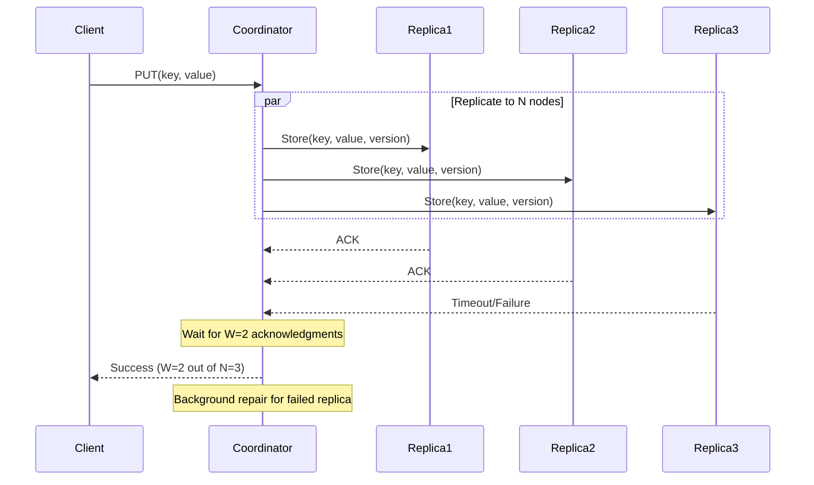

## 🧪 Test Strategy

### Testing Distributed Systems
```mermaid
graph TD
    A[DHT Testing] --> B[Functional Testing]
    A --> C[Failure Testing]
    A --> D[Performance Testing]
    A --> E[Consistency Testing]
    
    B --> B1[Basic CRUD operations]
    B --> B2[Ring topology maintenance]
    B --> B3[Data migration on join/leave]
    B --> B4[Replication consistency]
    
    C --> C1[Node crashes]
    C --> C2[Network partitions]
    C --> C3[Byzantine failures]
    C --> C4[Gradual degradation]
    
    D --> D1[Lookup latency O log N]
    D --> D2[Throughput under load]
    D --> D3[Storage efficiency]
    D --> D4[Network bandwidth usage]
    
    E --> E1[Read-your-writes]
    E --> E2[Eventual consistency]
    E --> E3[Conflict resolution]
    E --> E4[Vector clock ordering]
```

### Chaos Engineering
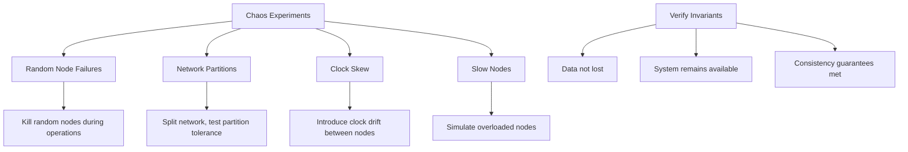

## 💡 Interview Discussion Points

### Common Questions

**Q: "How do you handle the 'hot spot' problem?"**
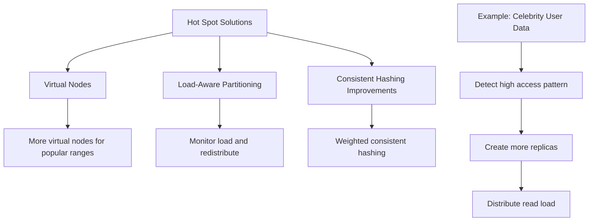

**Q: "How do you ensure data durability?"**
```python
# Multi-level durability strategy
class DataDurability:
    def __init__(self):
        self.replication_factor = 3      # N replicas
        self.write_quorum = 2           # W acknowledgments needed
        self.read_quorum = 2            # R replicas to read from
        # W + R > N ensures strong consistency
    
    def write_with_durability(self, key, value):
        # 1. Write to local disk (WAL)
        # 2. Replicate to N-1 other nodes
        # 3. Wait for W acknowledgments
        # 4. Periodic backup to long-term storage
        pass
```

**Q: "How do you handle network partitions?"**
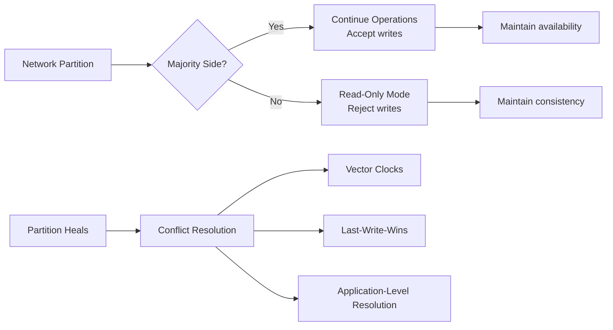

### Performance Characteristics
| Operation | DHT | Traditional DB | Notes |
|-----------|-----|----------------|-------|
| **Lookup** | O(log N) | O(1) with index | DHT scales better |
| **Insert** | O(log N) | O(log N) | Similar performance |
| **Range Queries** | O(N) | O(log N + k) | DHT weakness |
| **Join/Leave** | O(log²N) | N/A | DHT advantage |

## 🎯 Real-World Applications

### Content Distribution Network (CDN)
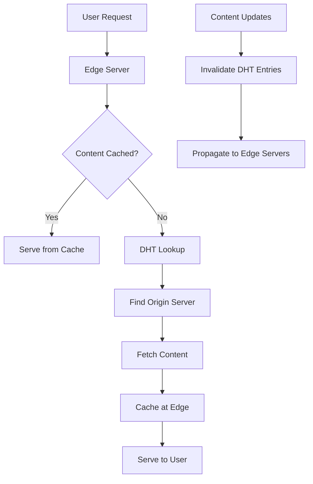

### Blockchain Networks
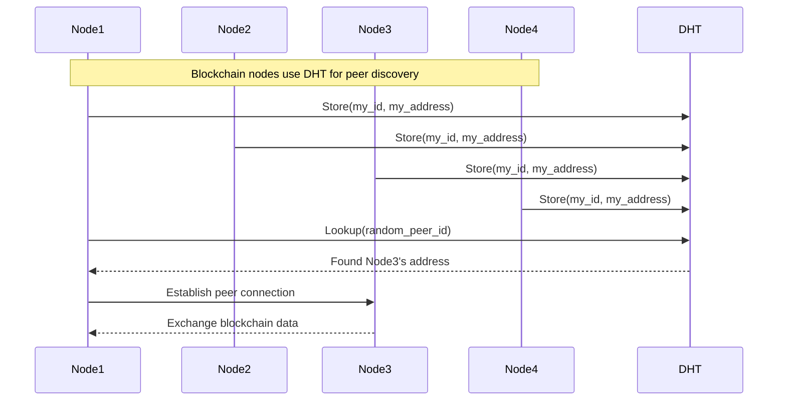

## 🔧 Advanced Features

### Vector Clocks for Causality
```mermaid
graph LR
    A[Vector Clock: [A:1, B:0, C:0]] --> B[Node A updates]
    B --> C[Vector Clock: [A:2, B:0, C:0]]
    
    D[Vector Clock: [A:1, B:1, C:0]] --> E[Node B updates]
    E --> F[Vector Clock: [A:1, B:2, C:0]]
    
    G[Concurrent Updates] --> H{Compare Clocks}
    H --> I[Detect Conflicts]
    I --> J[Application Resolution]
```

### Anti-Entropy and Read Repair
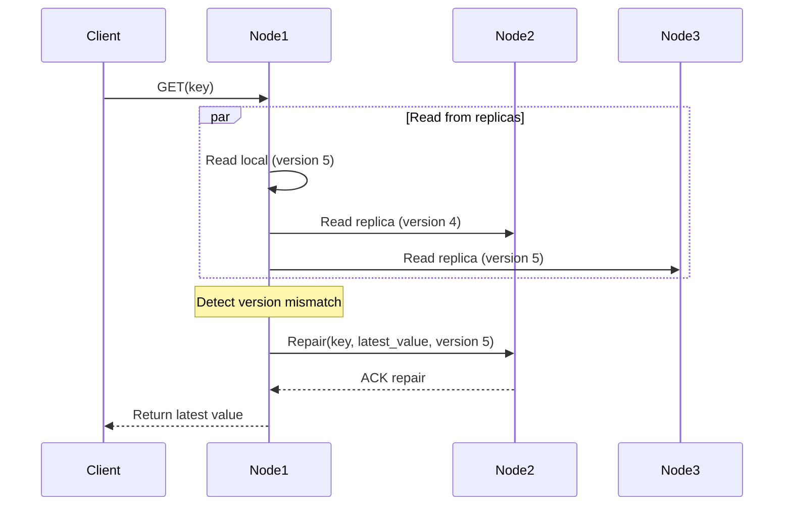

## 🚀 Implementation Guide

### Phase 1: Single Node Hash Table
```python
# 1. Basic key-value storage
# 2. Hash function implementation
# 3. Simple get/put operations
```

### Phase 2: Consistent Hashing Ring
```python
# 1. Ring topology with virtual nodes
# 2. Node join/leave protocols
# 3. Key routing and lookup
```

### Phase 3: Replication and Fault Tolerance
```python
# 1. Multi-replica storage
# 2. Quorum-based operations
# 3. Failure detection and recovery
```

### Phase 4: Advanced Consistency
```python
# 1. Vector clocks for causality
# 2. Conflict resolution strategies
# 3. Anti-entropy mechanisms
```

## 🧪 Testing Your Implementation

```bash
# Test basic DHT operations
pytest test_distributed_hash_table.py::TestDHTNode -v

# Test consistent hashing
pytest test_distributed_hash_table.py::TestConsistentHashRing -v

# Test failure scenarios
pytest test_distributed_hash_table.py::TestFailureScenarios -v

# Performance and consistency tests
pytest test_distributed_hash_table.py::TestPerformance -v
pytest test_distributed_hash_table.py::TestConsistencyLevels -v
```

## 🏆 Success Criteria

After completing this challenge:
- ✅ Understand distributed systems fundamentals
- ✅ Implement consistent hashing correctly
- ✅ Handle node failures and network partitions
- ✅ Design for eventual consistency
- ✅ Implement conflict resolution strategies
- ✅ Optimize for scalability and performance
- ✅ Apply CAP theorem trade-offs in practice
- ✅ Debug complex distributed system issues