# Advanced Consistent Hashing

## 🎯 Problem Overview

Consistent hashing is crucial for building scalable distributed systems. This advanced implementation covers virtual nodes, weighted hashing, load balancing, and hotspot detection - essential skills for designing systems like CDNs, databases, and load balancers.

## 🎨 Visual Architecture

### Consistent Hashing with Virtual Nodes


### Load Balancing Strategies
```mermaid
graph TD
    A[Load Balancing Request] --> B{Strategy?}
    
    B --> C[Consistent Hash<br/>Deterministic placement]
    B --> D[Least Loaded<br/>Real-time metrics]
    B --> E[Round Robin<br/>Sequential assignment]
    B --> F[Power of Two<br/>Random sampling]
    
    C --> G[Hash(key) → Node]
    D --> H[Monitor node load → Choose lightest]
    E --> I[Counter % num_nodes]
    F --> J[Sample 2 nodes → Choose better]
    
    K[Request Routing] --> L[Primary Node]
    L --> M{Node Healthy?}
    M -->|Yes| N[Route Request]
    M -->|No| O[Find Next Available Node]
```

## 🔑 Key Concepts

### Virtual Nodes Benefits


### Weighted Consistent Hashing


## 🏗️ Advanced Features

### Hotspot Detection and Mitigation


### Multi-Level Load Balancing


## 🧪 Test Strategy

### Hash Distribution Quality Testing


### Performance Benchmarking


## 💡 Interview Discussion Points

### Algorithm Comparison
```mermaid
graph LR
    A[Hashing Algorithms] --> B[Standard Consistent Hashing]
    A --> C[Rendezvous Hashing]
    A --> D[Jump Consistent Hash]
    A --> E[Maglev Hashing]
    
    B --> B1[Good: Simple, widely used<br/>Bad: Poor distribution without VNodes]
    C --> C1[Good: Perfect distribution<br/>Bad: O(N) lookup time]
    D --> D1[Good: Minimal memory, O(1)<br/>Bad: Limited flexibility]
    E --> E1[Good: Google-proven, fast<br/>Bad: Complex implementation]
```

### Common Questions

**Q: "How do you handle hash ring rebalancing?"**
```python
class RebalancingStrategy:
    def add_node(self, new_node):
        # 1. Calculate new virtual node positions
        # 2. Identify affected key ranges
        # 3. Migrate data gradually (avoid thundering herd)
        # 4. Update routing tables atomically
        # 5. Monitor for completion
        pass
    
    def remove_node(self, node_id):
        # 1. Mark node as leaving (no new requests)
        # 2. Redistribute virtual nodes
        # 3. Migrate data to new nodes
        # 4. Remove from ring atomically
        pass
```

**Q: "How do you optimize for cache locality?"**


**Q: "How do you handle network partitions?"**
| Scenario | Strategy | Trade-off |
|----------|----------|-----------|
| **Majority Partition** | Continue operations | Risk inconsistency |
| **Minority Partition** | Read-only mode | Reduced availability |
| **Split Brain** | Quorum-based decisions | Complex coordination |
| **Healing** | Conflict resolution | Temporary inconsistency |

## 🎯 Real-World Applications

### CDN Edge Server Selection

```mermaid
sequenceDiagram
    participant User
    participant DNS
    participant CDN_Controller
    participant EdgeServers
    
    User->>DNS: Resolve cdn.example.com
    DNS->>CDN_Controller: Get optimal edge server
    
    CDN_Controller->>CDN_Controller: User IP → Geographic hash
    CDN_Controller->>CDN_Controller: Content ID → Content hash
    CDN_Controller->>CDN_Controller: Combine hashes → Server selection
    
    CDN_Controller-->>DNS: Return edge server IP
    DNS-->>User: Edge server address
    
    User->>EdgeServers: Request content
    EdgeServers-->>User: Serve content
```


### Database Sharding


## 🔧 Advanced Implementation Patterns

### Hierarchical Consistent Hashing


### Dynamic Weight Adjustment


## 🚀 Implementation Guide

### Phase 1: Basic Consistent Hashing
```python
# 1. Hash ring with basic node placement
# 2. Key lookup algorithm
# 3. Node addition/removal
```

### Phase 2: Virtual Nodes
```python
# 1. Multiple virtual nodes per physical node
# 2. Weighted distribution
# 3. Load balancing improvements
```

### Phase 3: Advanced Load Balancing
```python
# 1. Multiple load balancing strategies
# 2. Health-aware routing
# 3. Performance monitoring
```

### Phase 4: Production Optimization
```python
# 1. Hotspot detection and mitigation
# 2. Dynamic rebalancing
# 3. Multi-level hash rings
```

## 🧪 Testing Your Implementation

```bash
# Test basic consistent hashing
pytest test_consistent_hashing.py::TestConsistentHashRing -v

# Test load balancing strategies
pytest test_consistent_hashing.py::TestLoadBalancer -v

# Test hotspot detection
pytest test_consistent_hashing.py::TestHotspotDetector -v

# Performance and distribution tests
pytest test_consistent_hashing.py::TestPerformance -v
pytest test_consistent_hashing.py::TestUtilityFunctions -v
```

## 🏆 Success Criteria

After completing this challenge:
- ✅ Master consistent hashing theory and practice
- ✅ Implement virtual nodes for better distribution
- ✅ Design weighted hashing for heterogeneous systems
- ✅ Build hotspot detection and mitigation
- ✅ Compare different hashing algorithms
- ✅ Optimize for real-world performance requirements
- ✅ Handle dynamic load balancing scenarios
- ✅ Apply consistent hashing to various system architectures