# Event Streaming System

## 🎯 Problem Overview

Event streaming systems like Apache Kafka, Amazon Kinesis, and Apache Pulsar are the backbone of modern data architectures. This challenge covers partitioning, ordering guarantees, consumer groups, and building resilient event-driven systems at scale.

## 🎨 Visual Architecture

### Event Streaming Architecture


### Topic Partitioning Strategy
```mermaid
graph TB
    A[Event with Key: "user_123"] --> B[Partition Function]
    B --> C[hash(key) % num_partitions]
    C --> D[Partition 1]
    
    E[Event with Key: "user_456"] --> B
    C --> F[Partition 2]
    
    G[Event with Key: "user_789"] --> B
    C --> H[Partition 0]
    
    subgraph "Partition 0"
    I[Event 1: user_789]
    J[Event 4: user_789]
    K[Event 7: user_222]
    end
    
    subgraph "Partition 1" 
    L[Event 2: user_123]
    M[Event 5: user_123]
    N[Event 8: user_456]
    end
    
    subgraph "Partition 2"
    O[Event 3: user_456]
    P[Event 6: user_111]
    Q[Event 9: user_111]
    end
```

## 🔑 Key Concepts

### Ordering Guarantees

```mermaid
graph LR
    A[Ordering Levels] --> B[No Ordering<br/>Highest throughput]
    A --> C[Per-Partition Ordering<br/>Balance performance/ordering]
    A --> D[Global Ordering<br/>Single partition only]
    
    E[Trade-off Spectrum] --> F[Throughput ←→ Ordering]
    
    B --> G[Parallel processing<br/>Out-of-order delivery possible]
    C --> H[Same key → same partition<br/>Ordering within partition]
    D --> I[Single threaded processing<br/>Strict global order]
```


### Consumer Group Rebalancing


### Offset Management and Delivery Guarantees


## 🏗️ System Architecture

### Event Processing Pipeline


### Consumer Group Coordination


## 🧪 Test Strategy

### Event Streaming Testing Pyramid


### Performance Testing Scenarios


## 💡 Interview Discussion Points

### Common Questions

**Q: "How do you handle backpressure in event streaming?"**


**Q: "How do you ensure exactly-once delivery?"**
```python
class ExactlyOnceProcessor:
    def __init__(self):
        self.processed_offsets = {}  # Idempotency tracking
        self.transaction_log = TransactionLog()
    
    def process_event(self, event, partition, offset):
        # 1. Check if already processed (idempotency)
        if self.is_already_processed(partition, offset):
            return "already_processed"
        
        # 2. Begin transaction
        with self.transaction_log.begin() as tx:
            # 3. Process event
            result = self.business_logic(event)
            
            # 4. Commit offset and result atomically
            tx.write_result(result)
            tx.commit_offset(partition, offset)
            
            # 5. Mark as processed
            self.mark_processed(partition, offset)
        
        return result
```

**Q: "How do you handle consumer lag?"**


### Performance Trade-offs
| Aspect | High Throughput | Low Latency | Strong Consistency |
|--------|----------------|-------------|-------------------|
| **Batching** | Large batches | Small batches | Sync commits |
| **Replication** | Async replication | Local replicas | Sync replication |
| **Partitions** | Many partitions | Fewer partitions | Single partition |
| **Compression** | High compression | No compression | Depends on use case |

## 🎯 Real-World Applications

### E-commerce Event Architecture


### Real-time Analytics Pipeline


## 🔧 Advanced Features

### Stream Processing Patterns


### Multi-Datacenter Replication


## 🚀 Implementation Guide

### Phase 1: Basic Event Streaming
```python
# 1. Event and Topic classes
# 2. Simple producer and consumer
# 3. In-memory partitioning
```

### Phase 2: Advanced Features
```python
# 1. Consumer groups and rebalancing
# 2. Offset management and persistence
# 3. Delivery guarantee options
```

### Phase 3: Performance and Reliability
```python
# 1. Batching and compression
# 2. Backpressure handling
# 3. Monitoring and metrics
```

### Phase 4: Production Ready
```python
# 1. Multi-datacenter replication
# 2. Stream processing primitives
# 3. Advanced consumer patterns
```

## 🧪 Testing Your Implementation

```bash
# Test basic event operations
pytest test_event_streaming.py::TestEvent -v

# Test partitioning and topics
pytest test_event_streaming.py::TestTopic -v

# Test consumer groups
pytest test_event_streaming.py::TestConsumerGroup -v

# Test end-to-end scenarios
pytest test_event_streaming.py::TestConcurrency -v
pytest test_event_streaming.py::TestPerformance -v
```

## 🏆 Success Criteria

After completing this challenge:
- ✅ Understand event streaming fundamentals
- ✅ Implement partitioning strategies correctly
- ✅ Handle consumer group rebalancing
- ✅ Manage offsets and delivery guarantees
- ✅ Build backpressure handling mechanisms
- ✅ Design for high-throughput scenarios
- ✅ Implement stream processing patterns
- ✅ Apply event streaming to real-world architectures
- ✅ Debug complex distributed streaming issues