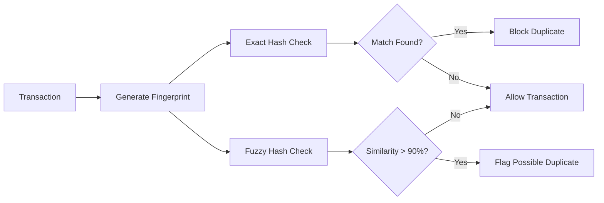
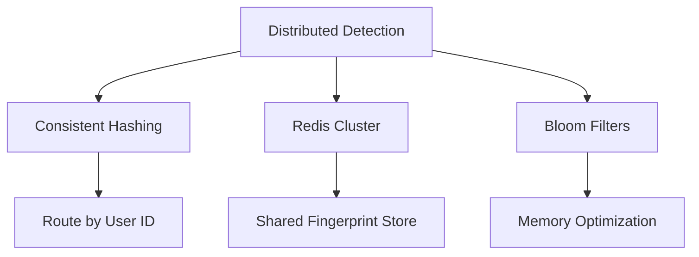

# Duplicate Detector - Interview Guide

## Problem Statement
**Time**: 20-25 minutes  
**Difficulty**: Medium-Hard  
**Frequency**: 30%+ of payment company interviews

Design a system to detect duplicate transactions in real-time using fuzzy matching beyond simple idempotency keys.

## Business Context
- Users double-click payment buttons
- Network issues cause duplicate requests
- Need to catch similar but not identical transactions
- Different from idempotency (same request) vs duplicates (similar transactions)

## System Overview



## Interview Approach

### Step 1: Clarify Requirements (3-4 minutes)

**Ask these questions:**
- What makes transactions similar? (amount, user, merchant, payment method)
- Time window for duplicates? (5-10 minutes typical)
- Exact vs fuzzy matching needed?
- How to handle legitimate duplicates?
- Memory constraints for fingerprints?

### Step 2: Design Fingerprinting Strategy (4-5 minutes)

```python
import hashlib
from datetime import datetime, timedelta
from dataclasses import dataclass
from typing import Dict, Set, Optional
import threading

@dataclass
class Transaction:
    id: str
    user_id: str
    merchant_id: str
    amount_cents: int
    currency: str
    payment_method_id: str
    timestamp: datetime

@dataclass 
class DuplicateMatch:
    is_duplicate: bool
    confidence_score: float  # 0.0 to 1.0
    matched_transaction_id: Optional[str]
    reason: str

class DuplicateDetector:
    def __init__(self, time_window_minutes: int = 5):
        self.time_window = timedelta(minutes=time_window_minutes)
        
        # Storage for fingerprints
        self.exact_fingerprints: Dict[str, str] = {}  # hash -> transaction_id
        self.fuzzy_fingerprints: Dict[str, Set[str]] = {}  # hash -> set of transaction_ids
        self.transaction_timestamps: Dict[str, datetime] = {}
        
        self.lock = threading.Lock()
    
    def check_duplicate(self, transaction: Transaction) -> DuplicateMatch:
        """Check if transaction is duplicate of recent transactions."""
        
        # Generate fingerprints
        exact_hash = self._generate_exact_hash(transaction)
        fuzzy_hash = self._generate_fuzzy_hash(transaction)
        
        with self.lock:
            # Cleanup old entries first
            self._cleanup_expired()
            
            # Check exact match
            if exact_hash in self.exact_fingerprints:
                matched_id = self.exact_fingerprints[exact_hash]
                return DuplicateMatch(
                    is_duplicate=True,
                    confidence_score=1.0,
                    matched_transaction_id=matched_id,
                    reason="Exact hash match"
                )
            
            # Check fuzzy match
            if fuzzy_hash in self.fuzzy_fingerprints:
                candidates = self.fuzzy_fingerprints[fuzzy_hash]
                for candidate_id in candidates:
                    confidence = self._calculate_similarity(transaction, candidate_id)
                    if confidence > 0.9:  # 90% similarity threshold
                        return DuplicateMatch(
                            is_duplicate=True,
                            confidence_score=confidence,
                            matched_transaction_id=candidate_id,
                            reason=f"Fuzzy match (confidence: {confidence:.2f})"
                        )
            
            # No duplicate found, store fingerprints
            self.exact_fingerprints[exact_hash] = transaction.id
            
            if fuzzy_hash not in self.fuzzy_fingerprints:
                self.fuzzy_fingerprints[fuzzy_hash] = set()
            self.fuzzy_fingerprints[fuzzy_hash].add(transaction.id)
            
            self.transaction_timestamps[transaction.id] = transaction.timestamp
            
            return DuplicateMatch(
                is_duplicate=False,
                confidence_score=0.0,
                matched_transaction_id=None,
                reason="No match found"
            )
```

### Step 3: Implement Hashing Strategies (6-8 minutes)

```python
def _generate_exact_hash(self, transaction: Transaction) -> str:
    """Generate hash for exact duplicate detection."""
    # Include all fields for exact matching
    data = f"{transaction.user_id}|{transaction.merchant_id}|{transaction.amount_cents}|{transaction.currency}|{transaction.payment_method_id}"
    return hashlib.sha256(data.encode()).hexdigest()

def _generate_fuzzy_hash(self, transaction: Transaction) -> str:
    """Generate hash for fuzzy duplicate detection."""
    # Only include key fields, ignore minor variations
    data = f"{transaction.user_id}|{transaction.merchant_id}|{transaction.amount_cents}|{transaction.currency}"
    return hashlib.sha256(data.encode()).hexdigest()

def _calculate_similarity(self, transaction: Transaction, candidate_id: str) -> float:
    """Calculate similarity score between transactions."""
    # In real implementation, would fetch candidate transaction
    # For interview, simulate similarity calculation
    
    score = 0.0
    
    # User match (40% weight)
    if self._user_matches(transaction, candidate_id):
        score += 0.4
    
    # Amount match (30% weight) 
    if self._amount_matches(transaction, candidate_id):
        score += 0.3
    
    # Merchant match (20% weight)
    if self._merchant_matches(transaction, candidate_id):
        score += 0.2
    
    # Time proximity (10% weight)
    if self._time_proximity(transaction, candidate_id):
        score += 0.1
    
    return score

def _cleanup_expired(self):
    """Remove fingerprints older than time window."""
    current_time = datetime.now()
    cutoff_time = current_time - self.time_window
    
    expired_transactions = []
    for txn_id, timestamp in self.transaction_timestamps.items():
        if timestamp < cutoff_time:
            expired_transactions.append(txn_id)
    
    for txn_id in expired_transactions:
        # Remove from all storage structures
        del self.transaction_timestamps[txn_id]
        
        # Remove from exact fingerprints
        self.exact_fingerprints = {
            h: id for h, id in self.exact_fingerprints.items() 
            if id != txn_id
        }
        
        # Remove from fuzzy fingerprints
        for fuzzy_hash, txn_set in self.fuzzy_fingerprints.items():
            txn_set.discard(txn_id)
```

### Step 4: Handle Edge Cases (4-5 minutes)

```python
def whitelist_duplicate(self, txn_id1: str, txn_id2: str):
    """Mark two transactions as legitimate duplicates."""
    # Store in whitelist to prevent future duplicate detection
    pass

def get_statistics(self) -> Dict[str, int]:
    """Get detector statistics."""
    with self.lock:
        return {
            "total_fingerprints": len(self.exact_fingerprints),
            "fuzzy_buckets": len(self.fuzzy_fingerprints),
            "memory_usage": len(self.transaction_timestamps)
        }

def _user_matches(self, transaction: Transaction, candidate_id: str) -> bool:
    # Check if same user
    return True  # Simulate match logic

def _amount_matches(self, transaction: Transaction, candidate_id: str) -> bool:
    # Check if amounts are identical or very close
    return True  # Simulate amount comparison

def _merchant_matches(self, transaction: Transaction, candidate_id: str) -> bool:
    # Check if same merchant
    return True

def _time_proximity(self, transaction: Transaction, candidate_id: str) -> bool:
    # Check if transactions are close in time
    return True
```

## Scaling Considerations



## Common Interview Questions

**Q: How do you handle legitimate duplicate amounts?**
A: Add context like merchant, payment method, and time proximity to distinguish.

**Q: What if users intentionally make the same purchase twice?**
A: Use time-based rules (allow duplicates after X minutes) and user behavior analysis.

**Q: How do you clean up old fingerprints?**
A: Background cleanup process removes entries older than time window.

**Q: How would you scale across multiple servers?**
A: Use consistent hashing by user ID to route to specific nodes, or shared Redis cluster.

## Implementation Checklist

- [ ] Implement exact and fuzzy hash generation
- [ ] Add time-window based cleanup
- [ ] Include similarity scoring algorithm
- [ ] Handle thread safety with locks
- [ ] Add memory usage monitoring
- [ ] Consider bloom filters for memory optimization
- [ ] Handle edge cases (whitelisting, legitimate duplicates)

## Time Management Tips

- **Minutes 0-4**: Requirements and fingerprinting strategy
- **Minutes 4-12**: Core hashing and matching implementation
- **Minutes 12-18**: Similarity scoring and cleanup
- **Minutes 18-22**: Edge cases and optimization
- **Minutes 22-25**: Scaling discussion

**Pro Tip**: Focus on the business logic of what makes transactions "similar" - this shows domain expertise in payments!