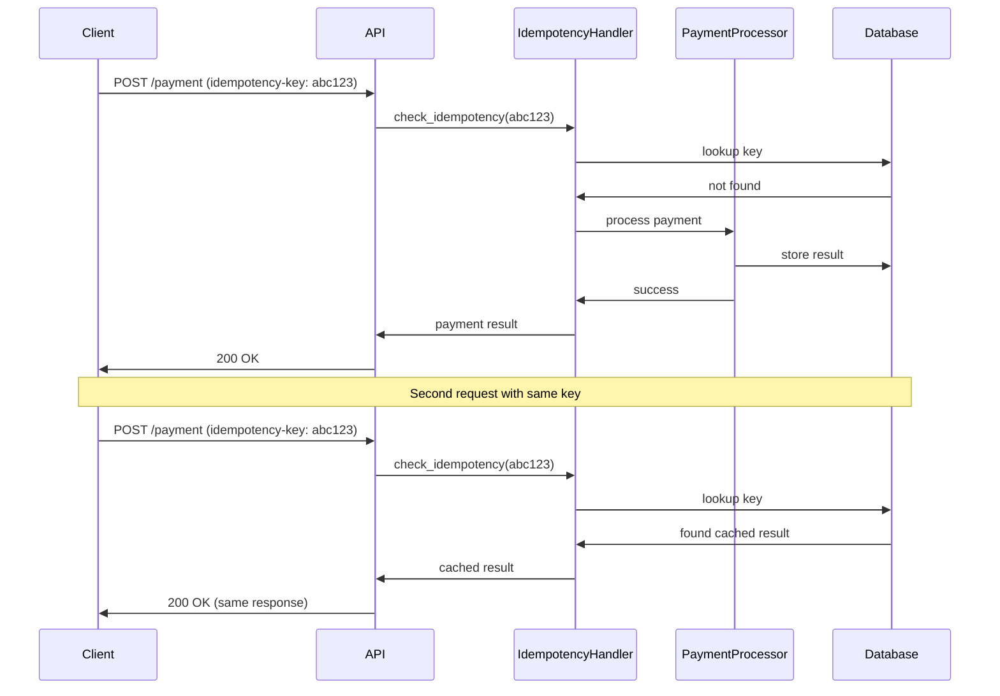
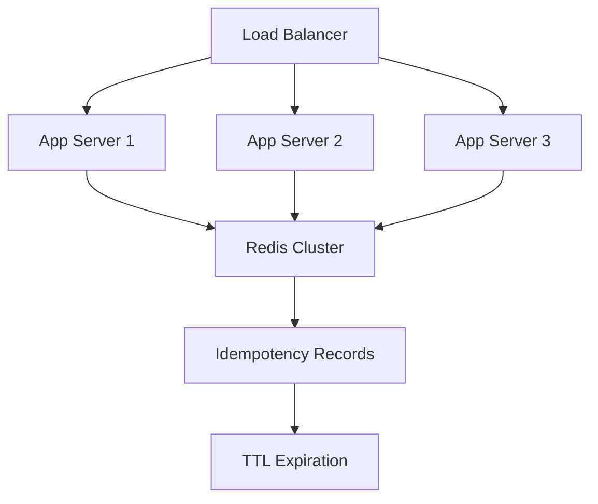

# Idempotency Handler - Interview Guide

## Problem Statement
**Time**: 15-20 minutes  
**Difficulty**: Medium  
**Frequency**: 30%+ of payment company interviews

Design an idempotency system that ensures duplicate API requests produce the same result without side effects, critical for payment operations.

## Business Context
- Network retries can cause duplicate payments
- Users refreshing payment pages
- API clients implementing retry logic
- Compliance requires consistent payment behavior
- Prevent charging customers multiple times

## System Overview



## Interview Approach

### Step 1: Clarify Requirements (2-3 minutes)

**Ask these questions:**
- How long to store idempotency records? (24 hours typical)
- What makes requests identical? (same key + same request body)
- What if request body differs with same key? (return error)
- Which operations need idempotency? (POST, PUT, not GET)
- How to handle key generation? (client-provided vs auto-generated)

### Step 2: Design Idempotency Strategy (3-4 minutes)

```python
import hashlib
import json
import time
from datetime import datetime, timedelta
from dataclasses import dataclass
from typing import Dict, Optional, Any
import threading

@dataclass
class IdempotencyRecord:
    key: str
    request_hash: str
    response: Dict[str, Any]
    status_code: int
    created_at: datetime
    expires_at: datetime

class IdempotencyHandler:
    def __init__(self, ttl_hours: int = 24):
        self.ttl_hours = ttl_hours
        self.records: Dict[str, IdempotencyRecord] = {}
        self.lock = threading.Lock()
    
    def check_idempotency(self, idempotency_key: str, request_data: Dict) -> Optional[IdempotencyRecord]:
        """Check if request is duplicate and return cached response if so."""
        
        request_hash = self._hash_request(request_data)
        
        with self.lock:
            # Clean up expired records
            self._cleanup_expired()
            
            if idempotency_key in self.records:
                record = self.records[idempotency_key]
                
                # Check if request data matches
                if record.request_hash == request_hash:
                    # Exact duplicate - return cached response
                    return record
                else:
                    # Same key but different request - conflict
                    raise IdempotencyConflictError(
                        f"Idempotency key {idempotency_key} used with different request data"
                    )
            
            return None  # No existing record
    
    def store_response(self, idempotency_key: str, request_data: Dict, 
                      response: Dict, status_code: int) -> None:
        """Store response for future idempotency checks."""
        
        request_hash = self._hash_request(request_data)
        expires_at = datetime.now() + timedelta(hours=self.ttl_hours)
        
        record = IdempotencyRecord(
            key=idempotency_key,
            request_hash=request_hash,
            response=response,
            status_code=status_code,
            created_at=datetime.now(),
            expires_at=expires_at
        )
        
        with self.lock:
            self.records[idempotency_key] = record
```

### Step 3: Implement Core Logic (6-8 minutes)

```python
def _hash_request(self, request_data: Dict) -> str:
    """Generate consistent hash of request data."""
    # Sort keys for consistent hashing
    normalized = json.dumps(request_data, sort_keys=True, separators=(',', ':'))
    return hashlib.sha256(normalized.encode()).hexdigest()

def _cleanup_expired(self) -> None:
    """Remove expired idempotency records."""
    current_time = datetime.now()
    expired_keys = []
    
    for key, record in self.records.items():
        if current_time > record.expires_at:
            expired_keys.append(key)
    
    for key in expired_keys:
        del self.records[key]

def generate_idempotency_key(self, request_data: Dict, user_id: str = None) -> str:
    """Generate idempotency key from request content."""
    # Include user ID and timestamp for uniqueness
    timestamp = str(int(time.time()))
    content_hash = self._hash_request(request_data)[:16]  # First 16 chars
    
    if user_id:
        return f"{user_id}_{timestamp}_{content_hash}"
    else:
        return f"{timestamp}_{content_hash}"

class IdempotencyConflictError(Exception):
    """Raised when same idempotency key used with different request data."""
    pass

# Decorator for automatic idempotency handling
def idempotent_operation(handler: IdempotencyHandler):
    """Decorator to make API operations idempotent."""
    def decorator(func):
        def wrapper(*args, **kwargs):
            # Extract idempotency key from request
            idempotency_key = kwargs.get('idempotency_key')
            request_data = kwargs.get('request_data', {})
            
            if not idempotency_key:
                # Generate key if not provided
                idempotency_key = handler.generate_idempotency_key(request_data)
            
            # Check for existing record
            existing_record = handler.check_idempotency(idempotency_key, request_data)
            if existing_record:
                return existing_record.response, existing_record.status_code
            
            # Execute the operation
            try:
                response, status_code = func(*args, **kwargs)
                
                # Store successful response
                handler.store_response(idempotency_key, request_data, response, status_code)
                
                return response, status_code
                
            except Exception as e:
                # Don't cache errors, let them retry
                raise e
        
        return wrapper
    return decorator
```

### Step 4: Add Payment-Specific Features (4-5 minutes)

```python
class PaymentIdempotencyHandler(IdempotencyHandler):
    """Specialized handler for payment operations."""
    
    def __init__(self, ttl_hours: int = 24):
        super().__init__(ttl_hours)
        self.payment_states: Dict[str, str] = {}  # key -> payment_id
    
    def handle_payment_request(self, idempotency_key: str, payment_data: Dict) -> Dict:
        """Handle idempotent payment processing."""
        
        # Check if we've seen this request before
        existing_record = self.check_idempotency(idempotency_key, payment_data)
        if existing_record:
            return existing_record.response
        
        # Process new payment
        payment_result = self._process_payment(payment_data)
        
        # Store the result
        self.store_response(
            idempotency_key,
            payment_data, 
            payment_result,
            200 if payment_result['status'] == 'success' else 400
        )
        
        return payment_result
    
    def _process_payment(self, payment_data: Dict) -> Dict:
        """Simulate payment processing."""
        import random
        
        # Simulate processing time
        time.sleep(0.1)
        
        # Simulate success/failure
        if random.random() > 0.1:  # 90% success rate
            return {
                'payment_id': f"pay_{int(time.time())}",
                'status': 'success',
                'amount': payment_data.get('amount'),
                'currency': payment_data.get('currency', 'USD')
            }
        else:
            return {
                'status': 'failed',
                'error': 'Payment processor unavailable'
            }
    
    def get_statistics(self) -> Dict[str, int]:
        """Get idempotency handler statistics."""
        with self.lock:
            current_time = datetime.now()
            active_records = sum(
                1 for record in self.records.values() 
                if current_time <= record.expires_at
            )
            
            return {
                'total_records': len(self.records),
                'active_records': active_records,
                'memory_usage_mb': len(str(self.records)) / (1024 * 1024)
            }

# Usage example
idempotency_handler = PaymentIdempotencyHandler()

@idempotent_operation(idempotency_handler)
def charge_payment(request_data: Dict, idempotency_key: str = None):
    """Charge payment with idempotency protection."""
    # This would be your actual payment processing logic
    return {'payment_id': 'pay_123', 'status': 'success'}, 200
```

## Distributed Idempotency



## Common Interview Questions

**Q: What if two identical requests arrive simultaneously?**
A: Use database transactions or Redis SET NX (set if not exists) for atomic check-and-set.

**Q: How do you handle different request bodies with the same idempotency key?**
A: Return 409 Conflict error - client must use different key for different requests.

**Q: Should you cache failed responses?**
A: Generally no - let clients retry failures. Only cache successful operations.

**Q: How do you handle partial failures?**
A: Use database transactions to ensure atomicity between operation and idempotency record storage.

## Implementation Checklist

- [ ] Generate consistent request hashes for comparison
- [ ] Store responses with TTL for automatic cleanup
- [ ] Handle idempotency key conflicts properly
- [ ] Use atomic operations for check-and-set
- [ ] Don't cache transient failures
- [ ] Include request validation in hash
- [ ] Monitor memory usage and cleanup patterns
- [ ] Consider distributed storage for scaling

## Time Management Tips

- **Minutes 0-3**: Requirements and conflict handling strategy
- **Minutes 3-9**: Core check/store implementation with hashing
- **Minutes 9-14**: Payment-specific features and error handling
- **Minutes 14-17**: Scaling and distributed considerations
- **Minutes 17-20**: Questions and edge cases

**Pro Tip**: Emphasize the importance of request body hashing - this prevents clients from accidentally reusing keys with different data!