# Money Handler - Interview Guide

## Problem Statement
**Time**: 15-20 minutes  
**Difficulty**: Easy-Medium  
**Frequency**: 80%+ of payment company interviews

Design a Money class that handles financial calculations with perfect precision. Avoid floating-point errors that can create or lose money.

## Business Context
- Payment systems must be penny-perfect
- Floating point arithmetic causes rounding errors
- Different currencies have different decimal places
- Regulatory compliance requires audit trails
- Tax calculations must be precise

## The Problem with Floats

```mermaid
graph LR
    A[0.1 + 0.2] --> B[0.30000000000000004]
    C[User expects] --> D[0.3]
    B --> E[💸 Money Lost/Created]
    D --> F[✅ Correct]
    
    style B fill:#FFB6C1
    style E fill:#FFB6C1
    style F fill:#90EE90
```



**Demo the Problem:**
```python
# This is wrong!
price = 0.1
tax = 0.2
total = price + tax
print(total)  # 0.30000000000000004 ❌

# This loses money over millions of transactions
```

## Interview Approach

### Step 1: Clarify Requirements (2-3 minutes)

**Ask these questions:**
- What currencies to support? (USD=2 decimals, JPY=0, BTC=8)
- What operations needed? (add, subtract, multiply, divide)
- How to handle rounding? (banker's rounding vs. round-half-up)
- Need currency conversion?
- How to split money? (handle remainder)

### Step 2: Choose Decimal Representation (2-3 minutes)

**Options to discuss:**


**Recommended: Python Decimal class**
- Arbitrary precision arithmetic
- Built-in rounding modes
- Handles different currency scales
- Industry standard for financial systems

### Step 3: Design Core Money Class (3-4 minutes)

```python
from decimal import Decimal, ROUND_HALF_UP
from typing import Union

CURRENCIES = {
    "USD": 2,
    "EUR": 2,
    "GBP": 2,
    "JPY": 0,  # No decimal places
    "BTC": 8,  # 8 decimal places
}

class Money:
    def __init__(self, amount: Union[str, int, float, Decimal], currency: str = "USD"):
        """Initialize Money with precise decimal amount."""
        if currency not in CURRENCIES:
            raise ValueError(f'Unsupported currency: {currency}')
        self.currency = currency
        decimal_places = CURRENCIES[currency]
        quantize_exp = Decimal('1') / (10 ** decimal_places)
        self.amount = Decimal(str(amount)).quantize(quantize_exp, rounding=ROUND_HALF_UP)
    
    def __str__(self) -> str:
        """Format money for display"""
        decimal_places = CURRENCIES[self.currency]
        formatted = f"{self.amount:.{decimal_places}f}"
        return f"{formatted} {self.currency}"
    
    def __repr__(self) -> str:
        return f"Money('{self.amount}', '{self.currency}')"
```

### Step 4: Implement Arithmetic Operations (6-8 minutes)

```python
def __add__(self, other: 'Money') -> 'Money':
    """Add two money amounts (same currency only)."""
    if self.currency != other.currency:
        raise ValueError(f'Cannot add {self.currency} and {other.currency}')
    result_amount = self.amount + other.amount
    return Money(result_amount, self.currency)

def __sub__(self, other: 'Money') -> 'Money':
    """Subtract two money amounts (same currency only)."""
    if self.currency != other.currency:
        raise ValueError(f'Cannot subtract {self.currency} and {other.currency}')
    result_amount = self.amount - other.amount
    return Money(result_amount, self.currency)

def __mul__(self, multiplier: Union[int, float, Decimal]) -> 'Money':
    """Multiply money by a number."""
    result = self.amount * Decimal(str(multiplier))
    return Money(result, self.currency)

def __truediv__(self, divisor: Union[int, float, Decimal]) -> 'Money':
    """Divide money by a number."""
    if divisor == 0:
        raise ValueError('Cannot divide by zero.')
    result = self.amount / Decimal(str(divisor))
    return Money(result, self.currency)

def __eq__(self, other: 'Money') -> bool:
    """Check if two money amounts are equal."""
    if not isinstance(other, Money):
        return False
    return self.currency == other.currency and self.amount == other.amount

def __lt__(self, other: 'Money') -> bool:
    """Check if this money is less than other."""
    if self.currency != other.currency:
        raise ValueError(f'Cannot compare {self.currency} and {other.currency}')
    return self.amount < other.amount
```

### Step 5: Handle Complex Operations (4-6 minutes)

**Money Splitting (Critical for payments):**
```python
def split(self, parts: int) -> list['Money']:
    """Split money into equal parts, handling remainder properly."""
    if parts <= 0:
        raise ValueError("Parts must be a positive integer")

    decimal_places = CURRENCIES[self.currency]
    quantize_exp = Decimal('1') / (10 ** decimal_places)

    # Base share
    share = (self.amount / parts).quantize(quantize_exp, rounding=ROUND_HALF_UP)

    # Total of shares might be off due to rounding, compute remainder
    total_distributed = share * parts
    remainder = self.amount - total_distributed

    # Create list with base share
    result = [Money(share, self.currency) for _ in range(parts)]

    # Distribute remainder (1 cent etc.) to first few recipients
    i = 0
    while remainder != Decimal('0.0'):
        result[i].amount += quantize_exp
        remainder -= quantize_exp
        i += 1

    return result

def convert_to(self, target_currency: str, exchange_rate: Decimal) -> 'Money':
    """Convert money to different currency."""
    if target_currency not in CURRENCIES:
        raise ValueError(f'Unsupported target country: {target_currency}')

    target_amount = self.amount * Decimal(str(exchange_rate))
    decimal_places = CURRENCIES[target_currency]
    quantize_exp = Decimal('1') / (10 ** decimal_places)
    target_amount = target_amount.quantize(quantize_exp, rounding=ROUND_HALF_UP)

    return Money(target_amount, target_currency)
```

**Simple Fee Calculations (without separate calculator class):**
```python
# Basic fee calculation as a simple function
def calculate_fee(amount: Money, fee_percentage: Decimal) -> Money:
    """Calculate fee as percentage of amount."""
    fee = amount.amount * fee_percentage
    return Money(fee, amount.currency)

# Example usage:
payment = Money("100.00", "USD")
processing_fee = calculate_fee(payment, Decimal("0.029"))  # 2.9%
total_with_fee = payment + processing_fee
```

## Money Arithmetic Flow


## Currency Handling

```mermaid
graph LR
    A[USD: $10.50] --> B[2 decimal places]
    C[JPY: ¥1050] --> D[0 decimal places]
    E[BTC: ₿0.00123456] --> F[8 decimal places]
    G[EUR: €10.50] --> H[2 decimal places]
    
    B --> I[Round to cents]
    D --> J[Round to whole yen]
    F --> K[Round to satoshis]
    H --> L[Round to cents]
```



## Common Interview Questions

**Q: How do you handle currency conversion precision?**
A: Store exchange rates as Decimal, apply conversion, then round to target currency's precision.

**Q: What happens when you divide money that doesn't split evenly?**
A: Distribute remainder using "largest remainder method" - give extra cents to first recipients.

**Q: How do you prevent money from being lost due to rounding?**
A: Always round individual items, then verify total equals sum of parts. Use banker's rounding for fairness.

**Q: How would you handle different currency decimal places?**
A: Store decimal places per currency and use quantize() with appropriate precision.

## Edge Cases to Discuss

```python
# 1. Splitting $1.00 three ways
money = Money("1.00", "USD")
parts = money.split(3)
# Result: [$0.34, $0.33, $0.33] - total still $1.00

# 2. Large number precision
large_amount = Money("999999999999.99", "USD")
fee = large_amount * Decimal("0.025")  # 2.5% fee

# 3. Currency conversion
usd = Money("100.00", "USD")
eur = usd.convert_to("EUR", Decimal("0.85"))

# 4. Zero and negative amounts
zero = Money("0.00", "USD")
negative = Money("-10.50", "USD")  # For refunds
```

## Testing Strategy

```python
def test_money_arithmetic():
    # Test basic operations
    price = Money("10.50", "USD")
    tax = Money("0.84", "USD") 
    total = price + tax
    assert str(total) == "11.34 USD"
    
    # Test precision
    unit_price = Money("3.33", "USD")
    quantity = 3
    subtotal = unit_price * quantity
    assert str(subtotal) == "9.99 USD"  # Not $9.990000001
    
    # Test splitting
    bill = Money("100.00", "USD")
    split_3_ways = bill.split(3)
    total_check = sum(split_3_ways, Money("0.00", "USD"))
    assert total_check == bill  # No money lost
    
    # Test comparison operations
    small = Money("5.00", "USD")
    large = Money("10.00", "USD")
    same = Money("5.00", "USD")
    assert small < large
    assert small == same
    
    # Test currency mismatch
    with pytest.raises(ValueError):
        Money("10", "USD") + Money("10", "EUR")
```

## Production Considerations

### Database Storage
```python
# Store as decimal(19,4) for most currencies
# Store currency code separately
# Example: amount=1050.0000, currency='USD'
```

### API Serialization
```python
def to_dict(self) -> dict:
    return {
        "amount": str(self.amount),  # Always serialize as string
        "currency": self.currency,
        "formatted": str(self)
    }

@classmethod
def from_dict(cls, data: dict):
    return cls(data["amount"], data["currency"])
```

## Implementation Checklist

- [ ] Use Decimal class for all money arithmetic
- [ ] Handle different currency decimal places
- [ ] Implement proper rounding (ROUND_HALF_UP)
- [ ] Support money splitting with remainder distribution
- [ ] Add currency validation and conversion
- [ ] Include comprehensive string formatting
- [ ] Test edge cases (zero, negative, large numbers)
- [ ] Consider thread safety for shared calculators

## Time Management Tips

- **Minutes 0-3**: Requirements and precision discussion
- **Minutes 3-7**: Basic Money class with arithmetic
- **Minutes 7-12**: Rounding, splitting, and currency handling
- **Minutes 12-16**: Edge cases and production considerations
- **Minutes 16-20**: Testing strategy and questions

**Pro Tip**: Always demo the float precision problem first! It immediately shows you understand why this matters in payments.