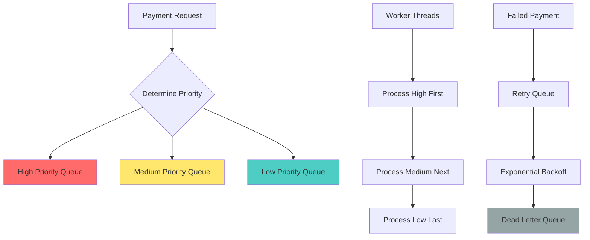
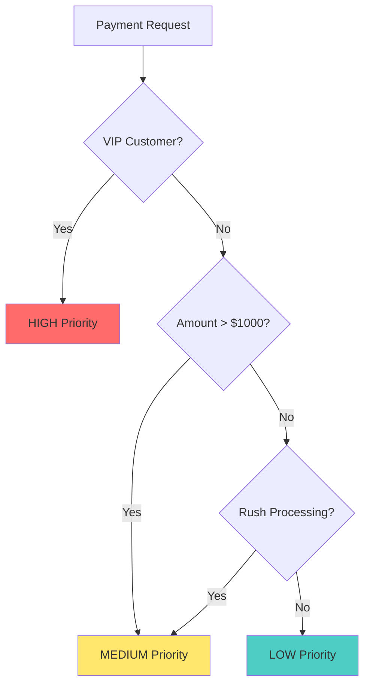

# Payment Queue - Interview Guide

## Problem Statement
**Time**: 20-25 minutes  
**Difficulty**: Medium  
**Frequency**: 50%+ of payment company interviews

Design a priority-based payment processing queue that handles high-priority payments first while ensuring all payments eventually get processed with retry logic.

## Business Context
- VIP customers get payment priority
- Large transactions need faster processing
- Failed payments should retry automatically
- Batch processing during off-peak hours
- Compliance requires payment audit trails

## System Overview



## Interview Approach

### Step 1: Clarify Requirements (3-4 minutes)

**Ask these questions:**
- How many priority levels? (typically 3: high, medium, low)
- What determines priority? (user tier, amount, merchant type)
- How many worker threads? (based on throughput needs)
- Retry strategy for failures? (exponential backoff)
- Dead letter queue for permanent failures?
- Need metrics and monitoring?

### Step 2: Design Priority System (3-4 minutes)

**Priority Assignment Logic:**



### Step 3: Design Core Classes (4-5 minutes)

```python
from enum import Enum
from dataclasses import dataclass
from datetime import datetime, timedelta
import threading
import time
import queue
from typing import Dict, List, Optional

class PaymentPriority(Enum):
    HIGH = 1    # VIP customers, large amounts
    MEDIUM = 2  # Regular priority
    LOW = 3     # Batch processing

class PaymentStatus(Enum):
    PENDING = "pending"
    PROCESSING = "processing" 
    COMPLETED = "completed"
    FAILED = "failed"
    RETRYING = "retrying"
    DEAD_LETTER = "dead_letter"

@dataclass
class Payment:
    id: str
    user_id: str
    amount_cents: int
    currency: str
    payment_method: str
    priority: PaymentPriority
    created_at: datetime
    retry_count: int = 0
    max_retries: int = 3

class PaymentQueue:
    def __init__(self, max_workers: int = 5):
        # Priority queues for different levels
        self.high_queue = queue.Queue()
        self.medium_queue = queue.Queue()
        self.low_queue = queue.Queue()
        self.retry_queue = queue.PriorityQueue()
        self.dead_letter_queue = queue.Queue()
        
        # Worker management
        self.max_workers = max_workers
        self.workers = []
        self.running = False
        
        # Payment tracking
        self.payment_status = {}
        self.lock = threading.Lock()
        
        # Statistics
        self.stats = {
            "processed": 0,
            "failed": 0,
            "retried": 0,
            "dead_lettered": 0
        }
```

### Step 4: Implement Core Processing (8-10 minutes)

```python
def enqueue_payment(self, payment: Payment) -> None:
    """Add payment to appropriate priority queue."""
    with self.lock:
        self.payment_status[payment.id] = PaymentStatus.PENDING
    
    # Route to correct priority queue
    if payment.priority == PaymentPriority.HIGH:
        self.high_queue.put(payment)
    elif payment.priority == PaymentPriority.MEDIUM:
        self.medium_queue.put(payment)
    else:
        self.low_queue.put(payment)

def start_workers(self) -> None:
    """Start worker threads for processing payments."""
    self.running = True
    
    for i in range(self.max_workers):
        worker = threading.Thread(
            target=self._worker_loop,
            name=f"PaymentWorker-{i}",
            daemon=True
        )
        worker.start()
        self.workers.append(worker)
    
    # Start retry processor
    retry_worker = threading.Thread(
        target=self._retry_processor,
        daemon=True
    )
    retry_worker.start()

def _worker_loop(self) -> None:
    """Main worker loop that processes payments by priority."""
    while self.running:
        payment = self._get_next_payment()
        
        if payment:
            self._process_payment(payment)
        else:
            time.sleep(0.1)  # No work available

def _get_next_payment(self) -> Optional[Payment]:
    """Get next payment following priority order."""
    # Try high priority first
    try:
        return self.high_queue.get_nowait()
    except queue.Empty:
        pass
    
    # Then medium priority
    try:
        return self.medium_queue.get_nowait()
    except queue.Empty:
        pass
    
    # Finally low priority
    try:
        return self.low_queue.get_nowait()
    except queue.Empty:
        pass
    
    return None

def _process_payment(self, payment: Payment) -> None:
    """Process a single payment with error handling."""
    with self.lock:
        self.payment_status[payment.id] = PaymentStatus.PROCESSING
    
    try:
        # Simulate payment processing
        success = self._call_payment_processor(payment)
        
        if success:
            with self.lock:
                self.payment_status[payment.id] = PaymentStatus.COMPLETED
                self.stats["processed"] += 1
        else:
            self._handle_payment_failure(payment)
            
    except Exception as e:
        self._handle_payment_failure(payment, str(e))

def _handle_payment_failure(self, payment: Payment, error: str = None) -> None:
    """Handle failed payment with retry logic."""
    payment.retry_count += 1
    
    if payment.retry_count <= payment.max_retries:
        # Schedule for retry with exponential backoff
        retry_delay = 2 ** (payment.retry_count - 1)  # 1s, 2s, 4s
        retry_time = time.time() + retry_delay
        
        with self.lock:
            self.payment_status[payment.id] = PaymentStatus.RETRYING
            self.stats["retried"] += 1
        
        self.retry_queue.put((retry_time, payment))
    
    else:
        # Max retries exceeded, send to dead letter queue
        with self.lock:
            self.payment_status[payment.id] = PaymentStatus.DEAD_LETTER
            self.stats["dead_lettered"] += 1
        
        self.dead_letter_queue.put(payment)

def _retry_processor(self) -> None:
    """Background thread that processes retry queue."""
    while self.running:
        try:
            retry_time, payment = self.retry_queue.get(timeout=1.0)
            
            # Wait until retry time
            current_time = time.time()
            if current_time < retry_time:
                time.sleep(retry_time - current_time)
            
            # Re-enqueue for processing
            self.enqueue_payment(payment)
            
        except queue.Empty:
            continue

def _call_payment_processor(self, payment: Payment) -> bool:
    """Simulate calling external payment processor."""
    time.sleep(0.1)  # Simulate processing time
    
    # Simulate success rates by priority
    import random
    if payment.priority == PaymentPriority.HIGH:
        return random.random() > 0.1  # 90% success
    elif payment.priority == PaymentPriority.MEDIUM:
        return random.random() > 0.2  # 80% success
    else:
        return random.random() > 0.3  # 70% success
```

### Step 5: Add Monitoring (3-4 minutes)

```python
def get_queue_stats(self) -> Dict[str, int]:
    """Get queue statistics for monitoring."""
    with self.lock:
        return {
            "high_queue_size": self.high_queue.qsize(),
            "medium_queue_size": self.medium_queue.qsize(), 
            "low_queue_size": self.low_queue.qsize(),
            "retry_queue_size": self.retry_queue.qsize(),
            "dead_letter_size": self.dead_letter_queue.qsize(),
            "total_processed": self.stats["processed"],
            "total_failed": self.stats["failed"],
            "total_retried": self.stats["retried"],
            "total_dead_lettered": self.stats["dead_lettered"]
        }

def determine_priority(self, user_id: str, amount_cents: int) -> PaymentPriority:
    """Business logic to determine payment priority."""
    # VIP customer check
    if user_id.startswith("vip_"):
        return PaymentPriority.HIGH
    
    # Large amount check
    if amount_cents >= 100000:  # $1000+
        return PaymentPriority.HIGH
    elif amount_cents >= 10000:  # $100+
        return PaymentPriority.MEDIUM
    
    return PaymentPriority.LOW
```

## Common Interview Questions

**Q: How do you prevent starvation of low-priority payments?**
A: Implement aging - gradually increase priority of old payments, or reserve worker capacity for low priority.

**Q: How would you scale this across multiple servers?**
A: Use Redis or RabbitMQ for distributed queues with consistent hashing.

**Q: What if all workers are busy with low-priority payments?**
A: Use separate worker pools per priority, or implement work-stealing from higher priority queues.

## Implementation Checklist

- [ ] Implement multi-level priority queues
- [ ] Add worker thread pool for processing
- [ ] Include retry logic with exponential backoff
- [ ] Add dead letter queue for failed payments
- [ ] Implement monitoring and statistics
- [ ] Handle graceful shutdown of workers
- [ ] Add payment priority determination logic

## Time Management Tips

- **Minutes 0-4**: Requirements and priority system design
- **Minutes 4-12**: Core queue implementation with workers
- **Minutes 12-18**: Retry logic and failure handling
- **Minutes 18-22**: Monitoring and advanced features
- **Minutes 22-25**: Questions and scaling discussion

**Pro Tip**: Start with the priority routing logic first - it shows you understand the business requirements!