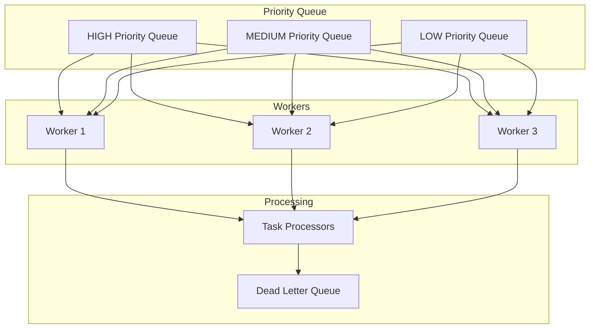
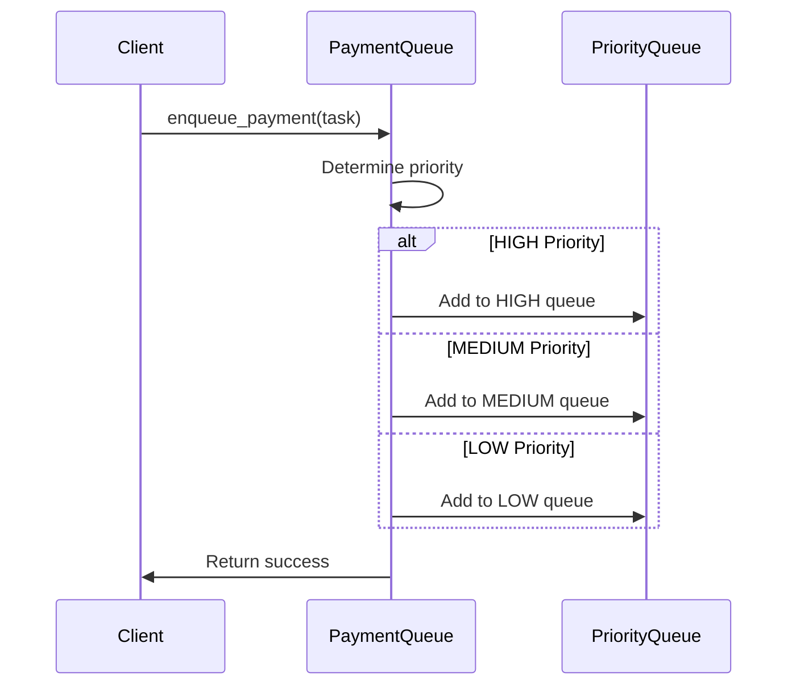
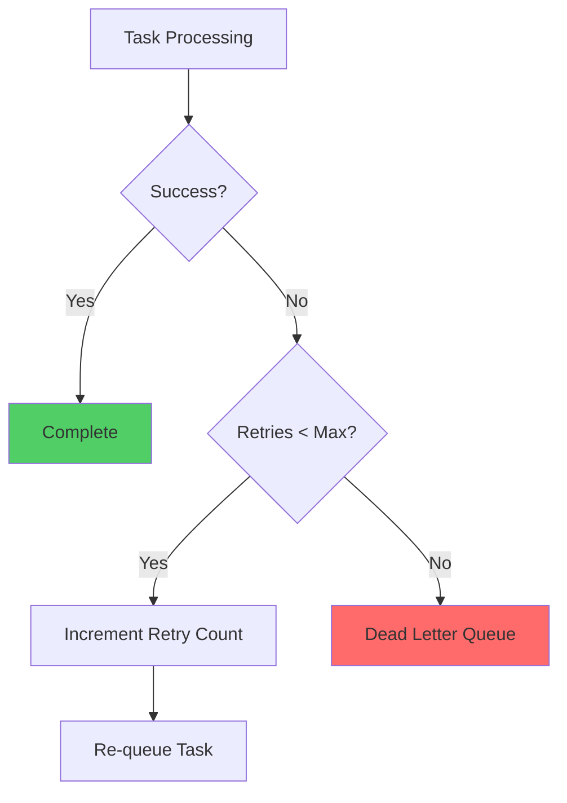

# 🚀 Understanding Payment Processing Queue with Analogies & Diagrams

## 🎯 Goal

Design a priority queue for payment processing that:

* Supports **3 priority levels**: HIGH, MEDIUM, LOW
* Maintains **FIFO** within same priority
* Provides **thread-safe** multi-worker processing
* Handles **graceful shutdown** without data loss
* Implements **dead letter queue** for failed tasks

---

## 🏪 Real-World Analogy

### Imagine: A busy restaurant kitchen

* **HIGH Priority**: Emergency orders (food poisoning complaint)
* **MEDIUM Priority**: Regular dinner orders
* **LOW Priority**: Prep work for tomorrow

The kitchen has multiple **cooks** (workers) who grab the **highest priority** ticket first. If someone burns a dish, they **retry** it. After 3 failed attempts, the order goes to the **manager** (dead letter queue).

---

## 📊 Priority Queue Structure



---

## 📦 Core Data Structures

### 1. `PaymentPriority`
```python
class PaymentPriority(Enum):
    HIGH = 1    # Fraud alerts, chargebacks
    MEDIUM = 2  # Regular payments
    LOW = 3     # Reports, analytics
```

### 2. `PaymentTask`
```python
@dataclass
class PaymentTask:
    id: str
    payment_id: str
    task_type: str
    priority: PaymentPriority
    payload: dict
    created_at: datetime
    max_retries: int = 3
    retry_count: int = 0
```

---

## 🏗️ Queue Architecture

### Internal Structure:
```python
class PaymentProcessingQueue:
    def __init__(self, num_workers: int = 3):
        self.priority_queues = {
            PaymentPriority.HIGH: queue.Queue(),
            PaymentPriority.MEDIUM: queue.Queue(),
            PaymentPriority.LOW: queue.Queue()
        }
        self.processors = {}  # task_type -> processor_function
        self.workers = []
        self.dead_letter_queue = []
        self.shutdown_event = threading.Event()
```

---

## 🔄 Queue Operations

### 🎯 `enqueue_payment(task)`

Adds task to appropriate priority queue:



---

### ⚡ Worker Processing Loop

Each worker follows this pattern:

```python
def _worker_loop(self, worker_id: int):
    while not self.shutdown_event.is_set():
        task = self._get_next_task()  # Priority order: HIGH → MEDIUM → LOW
        if task:
            success = self._process_task(task)
            if not success:
                self._handle_task_failure(task)
        else:
            time.sleep(0.1)  # Brief pause if no tasks
```

---

## 🎯 Priority Processing Logic

### `_get_next_task()` Implementation:

```python
def _get_next_task(self) -> Optional[PaymentTask]:
    # Try HIGH priority first
    try:
        return self.priority_queues[PaymentPriority.HIGH].get_nowait()
    except queue.Empty:
        pass
    
    # Then MEDIUM priority
    try:
        return self.priority_queues[PaymentPriority.MEDIUM].get_nowait()
    except queue.Empty:
        pass
        
    # Finally LOW priority
    try:
        return self.priority_queues[PaymentPriority.LOW].get_nowait()
    except queue.Empty:
        return None
```

---

## 💀 Dead Letter Queue Flow



### Retry Logic:
```python
def _handle_task_failure(self, task: PaymentTask):
    task.retry_count += 1
    if task.retry_count < task.max_retries:
        # Re-queue for retry
        self.enqueue_payment(task)
    else:
        # Send to dead letter queue
        with self.lock:
            self.dead_letter_queue.append(task)
```

---

## 🛑 Graceful Shutdown

### Shutdown Sequence:
1. **Signal Stop**: Set shutdown event
2. **Wait for Workers**: Allow current tasks to complete
3. **Save State**: Persist unprocessed tasks
4. **Clean Exit**: Join all worker threads

```python
def stop_workers(self, timeout_seconds: int = 30):
    self.shutdown_event.set()
    
    # Wait for workers to finish current tasks
    for worker in self.workers:
        worker.join(timeout=timeout_seconds)
    
    # Log remaining tasks
    remaining = self._count_remaining_tasks()
    print(f"Shutdown complete. {remaining} tasks remaining.")
```

---

## 📈 Task Processors

### Registration Pattern:
```python
# Register processors for different task types
queue.register_processor("charge_card", charge_card_processor)
queue.register_processor("fraud_check", fraud_check_processor)
queue.register_processor("send_notification", send_notification_processor)
```

### Processor Function Signature:
```python
def charge_card_processor(task: PaymentTask) -> bool:
    try:
        # Process the payment
        process_payment(task.payload)
        return True
    except Exception as e:
        logger.error(f"Payment failed: {e}")
        return False
```

---

## 📊 Monitoring & Stats

### `get_queue_stats()` returns:
```python
{
    "queue_sizes": {
        "HIGH": 5,
        "MEDIUM": 23,
        "LOW": 102
    },
    "active_workers": 3,
    "processed_count": 1547,
    "failed_count": 12,
    "dead_letter_count": 3
}
```

---

## 🧪 Example Usage Flow

```python
# Initialize queue
queue = PaymentProcessingQueue(num_workers=3)

# Register processors
queue.register_processor("charge_card", charge_card_processor)
queue.register_processor("fraud_check", fraud_check_processor)

# Start workers
queue.start_workers()

# Add tasks
fraud_task = PaymentTask(
    id="fraud_1",
    payment_id="pay_123", 
    task_type="fraud_check",
    priority=PaymentPriority.HIGH,  # ⚡ High priority!
    payload={"amount": 10000}
)

regular_task = PaymentTask(
    id="charge_1",
    payment_id="pay_124",
    task_type="charge_card", 
    priority=PaymentPriority.MEDIUM,
    payload={"card_id": "card_789"}
)

# Enqueue (fraud_task will be processed first)
queue.enqueue_payment(fraud_task)
queue.enqueue_payment(regular_task)
```

---

## 🔒 Thread Safety

All queue operations are thread-safe using:
- `queue.Queue()` for thread-safe queuing
- `threading.Lock()` for shared state
- `threading.Event()` for shutdown coordination

---

## 🧠 Interview Power Tips

* **Priority Inversion**: Prevent low-priority tasks from blocking high-priority ones
* **Backpressure**: Monitor queue sizes to prevent memory issues
* **Circuit Breaker**: Integrate with circuit breakers for external service calls
* **Idempotency**: Ensure tasks can be safely retried
* **Observability**: Rich metrics for monitoring queue health
* **Scaling**: Easy to add/remove workers dynamically

---

## 🔥 Advanced Features

* **Delayed Tasks**: Schedule tasks for future execution
* **Task Dependencies**: Wait for other tasks to complete
* **Rate Limiting**: Limit processing rate per task type
* **Batch Processing**: Group similar tasks for efficiency
* **Persistent Storage**: Survive application restarts