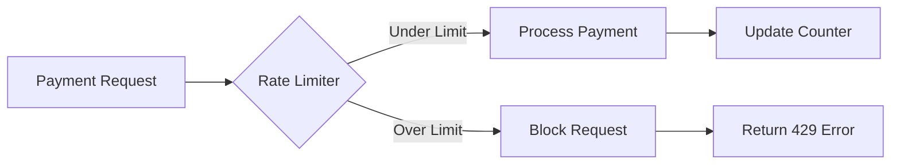
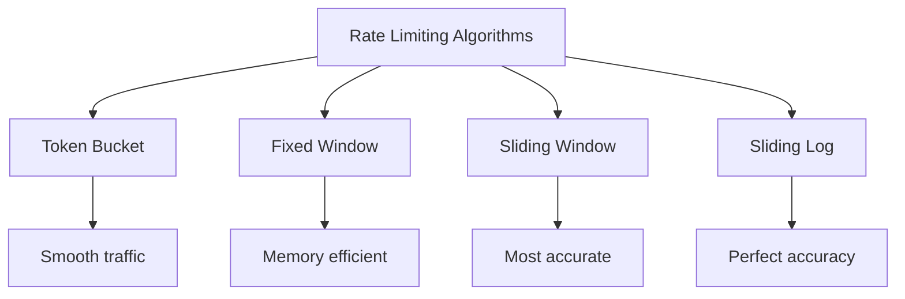
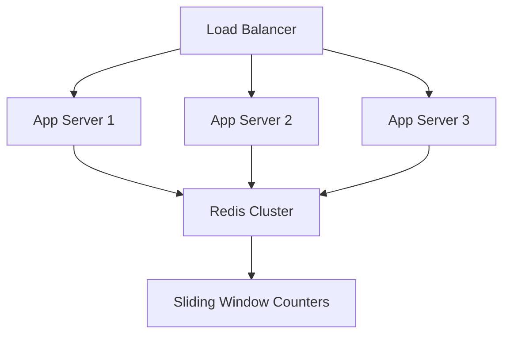

# Payment Rate Limiter - Interview Guide

## Problem Statement
**Time**: 15-20 minutes  
**Difficulty**: Easy  
**Frequency**: 70%+ of payment company interviews

Design a rate limiter to prevent payment fraud and abuse. Users should be limited to a certain number of payment attempts per time window.

## Business Context
- Prevent credit card testing attacks
- Stop brute force payment attempts  
- Protect against DDoS on payment endpoints
- Comply with payment processor limits

## System Overview



## Interview Approach

### Step 1: Clarify Requirements (2-3 minutes)

**Ask these questions:**
- What's the rate limit? (e.g., 10 requests per minute)
- Per what entity? (user ID, IP address, payment method)
- What time window? (sliding vs fixed window)
- How to handle limit exceeded? (block vs queue)
- Need to be thread-safe?

### Step 2: Choose Algorithm (2-3 minutes)

**Options to discuss:**



**Recommended: Sliding Window Counter**
- Good balance of accuracy and efficiency
- Handles burst traffic well
- Easy to implement and explain

### Step 3: Design Data Structures (3-4 minutes)

```python
from collections import deque
import threading
import time

class RateLimiter:
    def __init__(self, max_requests: int, window_seconds: int):
        # Storage: user_id -> deque of timestamps
        self.user_requests = {}
        self.max_requests = max_requests
        self.window_seconds = window_seconds
        self.lock = threading.Lock()
```

**Key Design Decisions:**
- Use `deque` for efficient timestamp storage
- `threading.Lock` for thread safety
- Clean up old timestamps automatically

### Step 4: Implement Core Logic (8-10 minutes)

```python
def is_allowed(self, user_id: str) -> bool:
    with self.lock:
        current_time = time.time()
        
        # Get or create user's request history
        if user_id not in self.user_requests:
            self.user_requests[user_id] = deque()
        
        requests = self.user_requests[user_id]
        
        # Remove old requests outside window
        cutoff_time = current_time - self.window_seconds
        while requests and requests[0] <= cutoff_time:
            requests.popleft()
        
        # Check if under limit
        if len(requests) < self.max_requests:
            requests.append(current_time)
            return True
        
        return False
```

### Step 5: Handle Edge Cases (3-4 minutes)

**Discuss these scenarios:**
- Clock skew/time changes
- Memory cleanup for inactive users
- Burst traffic patterns
- Distributed rate limiting

```python
def cleanup_inactive_users(self):
    """Remove users with no recent requests"""
    current_time = time.time()
    cutoff = current_time - self.window_seconds
    
    inactive_users = []
    for user_id, requests in self.user_requests.items():
        if not requests or requests[-1] <= cutoff:
            inactive_users.append(user_id)
    
    for user_id in inactive_users:
        del self.user_requests[user_id]
```

## Algorithm Comparison

| Algorithm | Memory | Accuracy | Burst Handling | Complexity |
|-----------|--------|----------|----------------|------------|
| Fixed Window | O(1) | Medium | Poor | Simple |
| Sliding Window | O(W) | High | Good | Medium |
| Token Bucket | O(1) | High | Excellent | Medium |
| Sliding Log | O(N) | Perfect | Good | Complex |

## Production Considerations

### Scaling Beyond Single Server



**Redis Implementation:**
```python
def is_allowed_distributed(self, user_id: str) -> bool:
    pipe = redis.pipeline()
    key = f"rate_limit:{user_id}"
    
    # Remove old timestamps
    cutoff = time.time() - self.window_seconds
    pipe.zremrangebyscore(key, 0, cutoff)
    
    # Count current requests
    pipe.zcard(key)
    
    # Add current request
    pipe.zadd(key, {str(time.time()): time.time()})
    
    # Set expiry
    pipe.expire(key, self.window_seconds)
    
    results = pipe.execute()
    request_count = results[1]
    
    return request_count <= self.max_requests
```

## Common Interview Questions

**Q: How would you handle distributed rate limiting?**
A: Use Redis with sorted sets, implementing sliding window with ZREMRANGEBYSCORE and ZCARD.

**Q: What if you need different limits for different user types?**
A: Add user tier lookup and configure limits per tier.

**Q: How do you prevent memory leaks?**
A: Implement cleanup job to remove inactive users and old timestamps.

**Q: How to handle rate limit exceeded?**
A: Return 429 status with Retry-After header indicating when to try again.

## Testing Strategy

```python
def test_rate_limiter():
    limiter = RateLimiter(max_requests=5, window_seconds=60)
    
    # Test normal usage
    for i in range(5):
        assert limiter.is_allowed("user1") == True
    
    # Test limit exceeded
    assert limiter.is_allowed("user1") == False
    
    # Test different user
    assert limiter.is_allowed("user2") == True
    
    # Test window sliding
    time.sleep(61)
    assert limiter.is_allowed("user1") == True
```

## Implementation Checklist

- [ ] Choose appropriate algorithm (sliding window recommended)
- [ ] Implement thread-safe storage
- [ ] Handle timestamp cleanup efficiently
- [ ] Add memory leak prevention
- [ ] Consider distributed scaling needs
- [ ] Return proper HTTP status codes
- [ ] Add monitoring and metrics

## Time Management Tips

- **Minutes 0-3**: Requirements and algorithm choice
- **Minutes 3-7**: Basic implementation
- **Minutes 7-12**: Edge cases and cleanup
- **Minutes 12-15**: Scaling discussion
- **Minutes 15-20**: Questions and optimizations

Remember: Start simple, then add complexity. The interviewer wants to see clear thinking and good engineering practices!