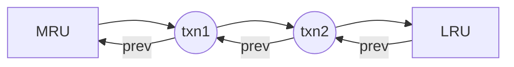
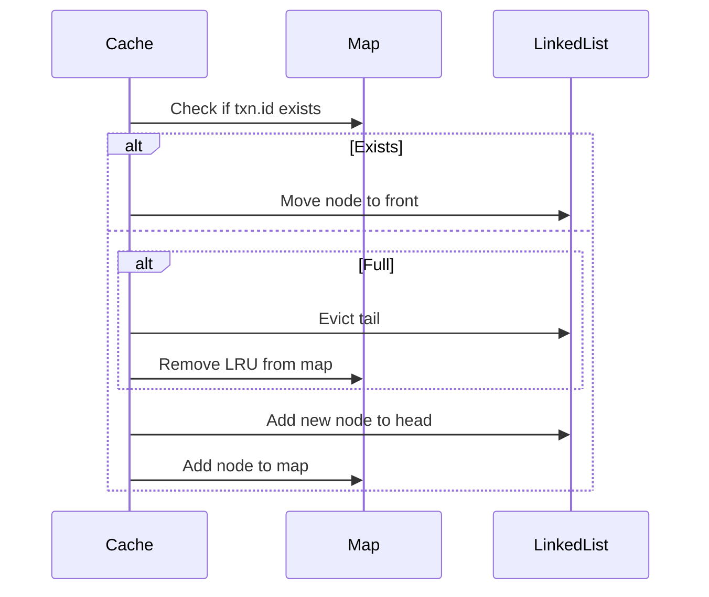
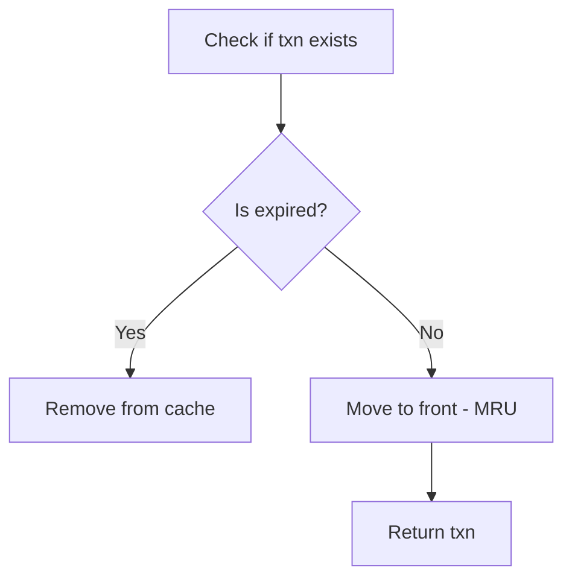

# 🧠 Understanding TransactionCache (TTL + LRU) with Analogies & Diagrams

## 🎯 Goal

Design a cache for recent transactions that:

* Supports **TTL** (time-based expiration)
* Supports **LRU** (least recently used eviction)
* Provides **O(1)** get/put/update
* Is **thread-safe** for concurrent access

---

## 🍱 Real-World Analogy

### Imagine: A restaurant kitchen fridge

* You can only store **`max_size`** number of meals (like transactions).
* Each meal has a **`expiry`** time (TTL).
* If the fridge is full, you throw away the **least recently used** meal (LRU).
* If someone eats a meal (accesses it), it becomes the **most recently used** (MRU).

You keep a map so you can find meals instantly. But you also track **who opened last and who is rotting quietly at the back**.

---

## 📦 Data Structures

### 1. `map: txn_id -> Node`

* O(1) lookup
* Think of it like a fridge inventory sheet.

### 2. `Doubly Linked List`

* Maintains usage order: **MRU at head**, **LRU at tail**
* Used for quick insert/remove/move operations

#### Mermaid Diagram:



---

## 🧱 Node Structure

```python
class Node:
    def __init__(self, txn: Transaction, expiry: datetime):
        self.txn = txn
        self.expiry = expiry
        self.prev = None
        self.next = None
```

Each node stores:

* `txn`: the transaction object
* `expiry`: TTL expiry time
* `prev/next`: pointers for the linked list

---

## 🔁 Cache Operations

### 🧊 `put(txn)`

* If txn exists: update value & expiry, move to front (MRU)
* Else:

  * If cache is full → evict LRU (tail)
  * Add new node to front (head)



---

### 🧊 `get(txn_id)`

* If txn exists:

  * Check if expired → remove
  * Else: move to front (MRU) and return
* Else: return None

### 🧊 `update_status(txn_id, new_status)`

* Similar to get, but updates the status instead of returning it

---

## 🔥 TTL Handling

Each `Node` stores its own expiry timestamp:

```python
if node.expiry < datetime.now():
    self._remove_node(node)
    del self.map[txn_id]
    return None
```

### 🔄 TTL + LRU Combo Flow



---

## 🧠 LRU Key Methods

### `_add_to_front(node)`

Adds node at the start of the list (MRU).

### `_remove_node(node)`

Detaches node from the list.

### `_move_to_front(node)`

Combines remove + add to front.

### `_evict_lru()`

Removes tail node and deletes it from the map.

---

## 🧪 Example Test Run

```python
cache = TransactionCache(max_size=2, ttl_seconds=2)
cache.put(txn1)       # [txn1]
cache.put(txn2)       # [txn2, txn1]
cache.get("txn1")     # [txn1, txn2]
cache.put(txn3)       # [txn3, txn1] → txn2 evicted (LRU)
cache.get("txn2")     # None
```

---

## 🧼 Final Notes

* Use `threading.Lock()` for safe concurrency 
* This is the same core logic behind Redis LRU + TTL and modern HTTP caching

---

## 🧠 Interview Power Tips

* Mention that `map + DLL` is the standard combo for O(1) LRU
* TTL needs per-entry timestamp to avoid a global scheduler
* Emphasize thread safety if asked in concurrent environments
* TTL expiration is lazy — only checked on access
