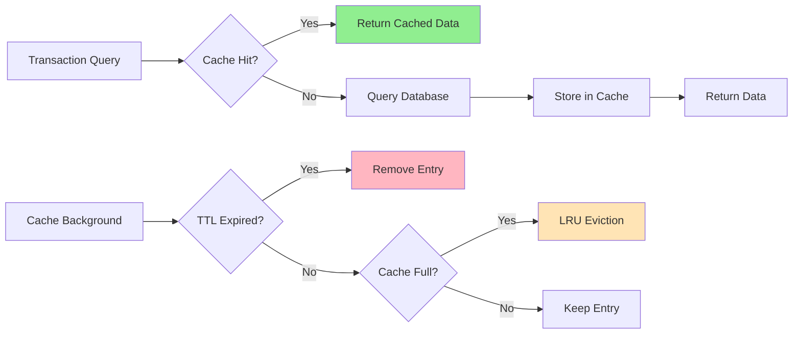
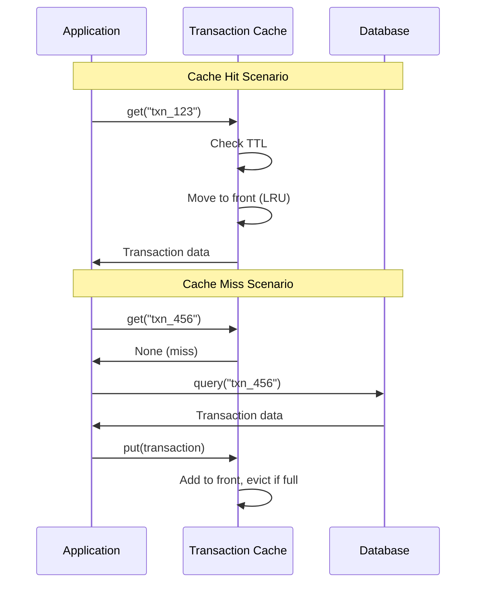

# Transaction Cache - Interview Guide

## Problem Statement
**Time**: 15-20 minutes  
**Difficulty**: Medium  
**Frequency**: 50%+ of payment company interviews

Design a high-performance cache for recent transactions with TTL (time-to-live) expiration and LRU eviction policy to improve payment processing speed.

## Business Context
- Users frequently check recent transaction status
- Reduce database load for hot transaction data
- Cache payment authorizations for quick retry
- Improve API response times for transaction queries
- Handle high-frequency trading scenarios

## System Overview



## Interview Approach

### Step 1: Clarify Requirements (2-3 minutes)

**Ask these questions:**
- What's the cache size limit? (e.g., 10,000 transactions)
- What's the TTL? (e.g., 30 minutes for fresh data)
- What data to cache? (full transaction vs. just status)
- Thread safety needed? (yes, for concurrent access)
- What eviction policy? (LRU is most common)
- Cache hit rate target? (80%+ is good)

### Step 2: Choose Cache Design (2-3 minutes)

**LRU + TTL Combination:**

```mermaid
graph TD
    A[Cache Design] --> B[HashMap for O(1) Access]
    A --> C[Doubly Linked List for LRU]
    A --> D[TTL Timestamp per Entry]
    
    B --> E[Key: transaction_id]
    C --> F[Most Recent at Head]
    D --> G[Background Cleanup]
    
    style A fill:#87CEEB
    style B fill:#90EE90
    style C fill:#90EE90
    style D fill:#90EE90
```

### Step 3: Design Data Structures (3-4 minutes)

```python
from dataclasses import dataclass
from datetime import datetime, timedelta
import threading
from typing import Dict, Optional, Any

@dataclass
class Transaction:
    id: str
    user_id: str
    amount_cents: int
    currency: str
    status: str
    created_at: datetime
    metadata: Dict[str, Any] = None

@dataclass
class CacheEntry:
    transaction: Transaction
    accessed_at: datetime
    expires_at: datetime

class CacheNode:
    """Doubly linked list node for LRU ordering."""
    def __init__(self, key: str, entry: CacheEntry):
        self.key = key
        self.entry = entry
        self.prev: Optional['CacheNode'] = None
        self.next: Optional['CacheNode'] = None

class TransactionCache:
    def __init__(self, max_size: int = 10000, ttl_minutes: int = 30):
        self.max_size = max_size
        self.ttl_minutes = ttl_minutes
        
        # Core storage
        self.cache: Dict[str, CacheNode] = {}
        
        # LRU doubly linked list
        self.head = CacheNode("", None)  # Dummy head
        self.tail = CacheNode("", None)  # Dummy tail
        self.head.next = self.tail
        self.tail.prev = self.head
        
        # Thread safety and stats
        self.lock = threading.Lock()
        self.hits = 0
        self.misses = 0
```

### Step 4: Implement Core Cache Operations (6-8 minutes)

```python
def get(self, transaction_id: str) -> Optional[Transaction]:
    """Get transaction from cache."""
    with self.lock:
        # Check if key exists
        if transaction_id not in self.cache:
            self.misses += 1
            return None
        
        node = self.cache[transaction_id]
        
        # Check if expired
        if self._is_expired(node.entry):
            # Remove expired entry
            self._remove_node(node)
            del self.cache[transaction_id]
            self.misses += 1
            return None
        
        # Move to front (most recently used)
        self._move_to_front(node)
        node.entry.accessed_at = datetime.now()
        
        self.hits += 1
        return node.entry.transaction

def put(self, transaction: Transaction) -> None:
    """Add/update transaction in cache."""
    with self.lock:
        transaction_id = transaction.id
        
        # Create cache entry with TTL
        expires_at = datetime.now() + timedelta(minutes=self.ttl_minutes)
        entry = CacheEntry(
            transaction=transaction,
            accessed_at=datetime.now(),
            expires_at=expires_at
        )
        
        if transaction_id in self.cache:
            # Update existing entry
            node = self.cache[transaction_id]
            node.entry = entry
            self._move_to_front(node)
        else:
            # Add new entry
            node = CacheNode(transaction_id, entry)
            self.cache[transaction_id] = node
            self._add_to_front(node)
            
            # Evict if over capacity
            if len(self.cache) > self.max_size:
                self._evict_lru()

def _is_expired(self, entry: CacheEntry) -> bool:
    """Check if cache entry has expired."""
    return datetime.now() > entry.expires_at

def _move_to_front(self, node: CacheNode) -> None:
    """Move node to front of LRU list."""
    self._remove_node(node)
    self._add_to_front(node)

def _add_to_front(self, node: CacheNode) -> None:
    """Add node to front of LRU list."""
    node.prev = self.head
    node.next = self.head.next
    self.head.next.prev = node
    self.head.next = node

def _remove_node(self, node: CacheNode) -> None:
    """Remove node from LRU list."""
    node.prev.next = node.next
    node.next.prev = node.prev

def _evict_lru(self) -> None:
    """Remove least recently used item."""
    lru_node = self.tail.prev
    if lru_node != self.head:  # Not empty
        self._remove_node(lru_node)
        del self.cache[lru_node.key]
```

### Step 5: Add Advanced Features (4-5 minutes)

```python
def cleanup_expired(self) -> int:
    """Remove all expired entries."""
    removed_count = 0
    current_time = datetime.now()
    
    with self.lock:
        # Collect expired keys
        expired_keys = []
        for key, node in self.cache.items():
            if current_time > node.entry.expires_at:
                expired_keys.append(key)
        
        # Remove expired entries
        for key in expired_keys:
            node = self.cache[key]
            self._remove_node(node)
            del self.cache[key]
            removed_count += 1
    
    return removed_count

def get_stats(self) -> Dict[str, Any]:
    """Get cache performance statistics."""
    total_requests = self.hits + self.misses
    hit_rate = (self.hits / total_requests * 100) if total_requests > 0 else 0
    
    with self.lock:
        return {
            "size": len(self.cache),
            "max_size": self.max_size,
            "hits": self.hits,
            "misses": self.misses,
            "hit_rate_percent": round(hit_rate, 2),
            "ttl_minutes": self.ttl_minutes
        }
```

## Cache Access Patterns



## Common Interview Questions

**Q: How do you handle cache invalidation?**
A: Use TTL for automatic expiration, plus explicit invalidation on transaction updates.

**Q: What if the cache becomes full?**
A: Implement LRU eviction - remove least recently used items first.

**Q: How do you prevent cache stampede?**
A: Use distributed locks or cache warming to prevent multiple threads loading same data.

**Q: How would you scale this across multiple servers?**
A: Use Redis cluster with consistent hashing, or implement cache partitioning by user ID.

## Implementation Checklist

- [ ] Implement O(1) get/put operations with HashMap + Doubly Linked List
- [ ] Add TTL expiration with background cleanup
- [ ] Include LRU eviction when cache is full
- [ ] Use locks for thread safety
- [ ] Support batch operations for efficiency
- [ ] Add comprehensive cache statistics
- [ ] Handle edge cases (empty cache, single item, etc.)

## Time Management Tips

- **Minutes 0-3**: Requirements and cache strategy discussion
- **Minutes 3-8**: Core LRU + TTL implementation
- **Minutes 8-12**: Thread safety and batch operations
- **Minutes 12-16**: Advanced features and cleanup
- **Minutes 16-20**: Performance discussion and questions

**Pro Tip**: Draw the doubly linked list structure first! It helps visualize the LRU mechanics and makes implementation much clearer.